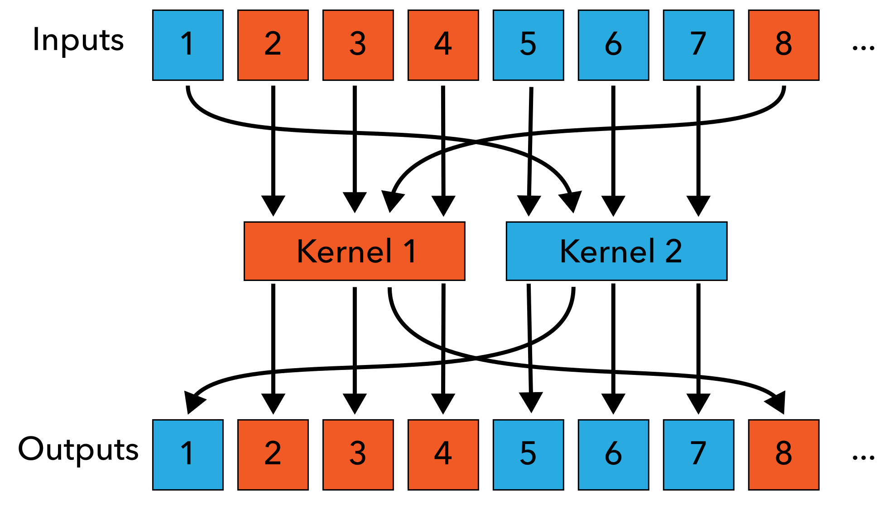

.. cpp:namespace:: drjit

.. _virtual-functions:

Virtual function calls
======================

One of the main purposes of Dr.Jit is to convert a piece of software into a
corresponding "wide" vectorized version that processes many inputs at once.
Advanced C++ features like like polymorphism can pose difficulties during this
transformation, which this section of the documentation addresses. Consider the
following example:

.. code-block:: cpp

    struct Base {
        virtual float eval(float x) = 0;
        virtual ~Base() = default;
    };

    struct Foo : Base { /* ...*/ };
    struct Bar : Base { /* ...*/ };

    void some_calculation(Base *base) {
        Base *base = /* .. */;
        float value = /* ... */;
        float result = base->f(value);
    }

An interface ``Base`` has two implementations ``Foo`` and ``Bar`` that each
provide different versions of a function ``foo()``.

Vectorizing this code entails replacing scalar types (like ``float``) by a
corresponding Dr.Jit array type (e.g. :cpp:struct:`Packet`,
:cpp:struct:`CUDAArray`, :cpp:struct:`LLVMArray`, or :cpp:struct:`DiffArray`)

Virtual method calls are important building blocks of 
object-oriented C++ and Python applications. 
When vectorization enters the picture, it is
not immediately clear how they should be dealt with. This section introduces
Dr.Jit's method call vectorization support, focusing on a hypothetical
``Sensor`` class that decodes a measurement performed by a sensor.

.. c:macro:: DRJIT_VCALL_REGISTER_IF(Class, Cond)

.. c:macro:: DRJIT_VCALL_REGISTER(Class)

.. c:macro:: DRJIT_VCALL_METHOD(name)

.. c:macro:: DRJIT_VCALL_GETTER(name, type)

.. c:macro:: DRJIT_VCALL_BEGIN(Name)

.. c:macro:: DRJIT_VCALL_END(Name)

.. c:macro:: DRJIT_VCALL_TEMPLATE_BEGIN(Name)

.. c:macro:: DRJIT_VCALL_TEMPLATE_END(Name)
