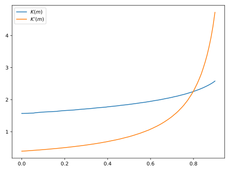

.. cpp:namespace:: drjit

.. _custom-autodiff:

Custom differentiable ops
=========================

Dr.Jit offers several escape hatches to implement custom features that are
difficult to express using builtin functionality. This section explains such
extension mechanisms related to automatic differentiation.

.. _custom-autodiff-cpp:

In C++
------

Dr.Jit can compute derivatives of builtin operations in both forward and reverse
mode. In rare cases, it may be useful or even necessary to tell Dr.Jit how a
particular operation should be differentiated. Reasons for this may include:

1. The automatic differentiation backend cannot keep track of computation that
   is performed outside of Dr.Jit (e.g. using a highly optimized :ref:`CUDA
   kernel <custom-cuda>`), or when :cpp:struct:`DiffArray` is not used for other
   reasons.

2. Multiple frameworks (e.g. PyTorch/TensorFlow and Dr.Jit) may be involved in
   larger projects, in which case gradient propagation requires a clear
   interface between them.

3. The derivative may admit a simplified analytic expression that is superior
   to what direct application of automatic differentiation would produce.

4. Automatic derivative propagation through Dr.Jit's :ref:`symbolic loops
   <recording-loops>` is not supported. They will always require extra steps as
   outlined here and in the section on :ref:`differentiating loops
   <diff-loop>`.

Custom differentiable operations require the creation of a class providing
callback functions that are invoked when the AD backend traverses the
associated node in the computation graph. This class also provides a convenient
way of stashing temporary results during the original function evaluation that
can be accessed later on as part of forward or reverse-mode differentiation.

To start, make sure to include the extra header file

.. code-block:: cpp

    #include <drjit/custom.h>

which provides all necessary infrastructure. Suppose, that we are working with
the following type:

.. code-block:: cpp

    // JIT-compiled array that furthermore tracks derivatives
    using Float = dr::DiffArray<dr::CUDAArray<float>>;

We must define the aforementioned callback class deriving from
:cpp:struct:`CustomOp`, which is a variadic template class parameterized by the
type underlying automatic differentiation (`FloatD` in this example), and the
function output and input(s).

.. code-block:: cpp

    struct MyOp : dr::CustomOp<Float, /* <-- type underlying AD backend */,
                               ...,   /* output type */,
                               ...    /* one or more input type (s) */> { ... };

Suppose that we're interested in computing the derivative of the following operation,
which normalizes a 3D input vector:

.. math::

   N(\mathbf{v}) := \frac{\mathbf{v}}{\|\mathbf{v}\|}

When :math:`\mathbf{v}` depends on an arbitrary parameter :math:`\theta`, the
derivative of the above expression is given by

.. math::

   \frac{\partial}{\partial \theta} N(\mathbf{v}(\theta)) :=
   \frac{1}{\|\mathbf{v}(\theta)\|}
   \frac{\partial\mathbf{v}(\theta)}{\partial \theta}
   - \frac{\mathbf{v}(\theta)}{\|\mathbf{v}(\theta)\|^3}
   \big\langle
   \mathbf{v}(\theta),
   \frac{\partial\mathbf{v}(\theta)}{\partial \theta}
   \big\rangle

Let's define non-differentiable and differentiable 3D vector types first:

.. code-block:: cpp

    using Array3f  = dr::Array<Float, 3>;

The basic structure of the ``Normalize`` class then looks as follows:

.. code-block:: cpp

    struct Normalize : dr::CustomOp<Float, Array3f, Array3f> {
        using Base = dr::CustomOp<Float, Array3f, Array3f>;

        // Return a descriptive name that used in GraphViz output
        const char *name() override { return "normalize"; }

        // .. continued shortly ..

    private:
        // Storage for temporary values
        Float m_inv_norm;
        Array3f m_input;
    };

Apart from ``name()``, this declaration must override *three* other virtual
methods: the first, ``eval()``, performs an ordinary (non-differentiable)
function evaluation. In particular, the function will be called with inputs
that are *detached* from the computation graph, and it must also return a
result with the same property (you don't need to worry about this unless your
function accesses some kind of global variable ``x`` with ``dr::grad_enabled(x)
== true``, in which case the function result must be passed through
:cpp:func:`detach()`). Finally, note the inputs must be specified as ``const``
references (see the following note).

.. note::

   The custom function interface assumes that the function's access to
   arguments is read-only, and that it produces all output via a single return
   value. Returning data via parameter references is not allowed.

   Returning multiple things is fine: the return type can be an Dr.Jit array,
   ``std::pair``, ``std::tuple`` or custom data structure exposed via
   :c:macro:`DRJIT_STRUCT`.

Here, our ``eval()`` implementation also stores two temporary variables
(``m_input`` and ``m_inv_norm``) since they are going to be useful in both
forward and reverse-mode derivative propagation.

.. code-block:: cpp

   Array3f eval(const Array3f &input) override {
       m_input = input;
       m_inv_norm = dr::rcp(dr::norm(input));
       return input * m_inv_norm;
   }


The forward-mode callback should query gradients arriving along the function
inputs via :cpp:func:`CustomOp::grad_in()`, where the template parameter
indicates the argument index. If the function only takes one input, it can also
be omitted. Before returning, the function must call
:cpp:func:`CustomOp::set_grad_out()` to assign the output gradient.

.. code-block:: cpp

    void forward() override {
        Array3f grad_in = Base::grad_in<0>(),
                grad_out = grad_in * m_inv_norm;
        grad_out -= m_input * (dr::dot(m_input, grad_out) *
                               dr::sqr(m_inv_norm));
        Base::set_grad_out(grad_out);
    }

Reverse-mode differentiation via ``backward()`` flips this around: the callback
should query gradients arriving along the function output via the
:cpp:func:`CustomOp::grad_out()` and then invoke
:cpp:func:`CustomOp::set_grad_in()` to assign the input gradient(s). In this
simple example, the two definitions are almost identical, though this is often
not the case.

.. code-block:: cpp

    void backward() override {
        Array3f grad_out = Base::grad_out(),
                grad_in = grad_out * m_inv_norm;
        grad_in -= m_input * (dr::dot(m_input, grad_in) *
                              dr::sqr(m_inv_norm));
        Base::set_grad_in<0>(grad_in);
    }

Once defined, the custom operation can be invoked as follows:

.. code-block:: cpp

   Array3f d = /* ... */;
   Array3f d2 = dr::custom<Normalize>(d);

.. _custom-autodiff-py:

In Python
---------

Please first review the section on :ref:`custom differentiable operations in
C++ <custom-autodiff-cpp>`. The Python syntax is very similar, except that input
arguments are referenced by name instead of index.

.. code-block:: python
    :emphasize-lines: 8, 19

    class Normalize(dr.CustomOp):
        def eval(self, value):
            self.value = value
            self.inv_norm = dr.rcp(dr.norm(value))
            return value * self.inv_norm

        def forward(self):
            grad_in = self.grad_in('value')
            grad_out = grad_in * self.inv_norm
            grad_out -= self.value * (dr.dot(self.value, grad_out) *
                                      dr.sqr(self.inv_norm))
            self.set_grad_out(grad_out)

        def backward(self):
            grad_out = self.grad_out()
            grad_in = grad_out * self.inv_norm
            grad_in -= self.value * (dr.dot(self.value, grad_in) *
                                     dr.sqr(self.inv_norm))
            self.set_grad_in('value', grad_in)

        def name(self):
            return "normalize"

Once defined, a custom operation can be invoked as follows:

.. code-block:: python

   import drjit as dr
   from drjit.cuda.ad import Array3f

   d = Array3f(...)
   d2 = dr.custom(Normalize, d)

.. _diff-loop:

Differentiable loops
--------------------

Iterative computation performed using normal C++ or Python loops is effectively
unrolled within the AD computation graph, and its differentiation poses no
problems. However, automatic differentiation of :ref:`symbolic loops
<recording-loops>` recorded using the :cpp:struct:`Loop` class is not currently
supported.

As the name indicates, reverse-mode differentiation traverses the computation
graph from outputs to inputs, which requires suitable reversed loop constructs
that are not available by default. While Dr.Jit could likely be modified to
generate them automatically, this would not produce an efficient result, as
each loop iteration would need to store copies of all loop variables to enable
a reversal under general conditions. For this reason, symbolic loops must
provide :ref:`custom derivative handling <custom-autodiff>`, which enables
targeted optimizations that exploit the properties of different types of loops.
The remainder of this section provides some examples in Python, though
everything applies equally to the C++ interface.

Trivially differentiable loops
``````````````````````````````

In the easiest case, the derivative of a loop containing some fragment of code
is simply that same loop containing the derivative of the fragment. For example,
suppose that we are estimating the value of an `Elliptic integral
<https://en.wikipedia.org/wiki/Elliptic_integral>`_ using Monte Carlo
integration, which entails generating a large number of random variates on the
interval :math:`[0, \frac{\pi}{2}]` and adding up evaluations of the integrand:

.. math::

   \begin{aligned}
       K(m)\coloneqq&\int_0^{\frac{\pi}{2}} \frac{1}{\sqrt{1-m\sin^2 \theta}}\mathrm{d}\theta\\
       \approx& \frac{1}{n}\sum_{i=1}^n\frac{1}{\sqrt{1-m\sin^2 \theta_i}}\mathrm{d}\theta\\
   \end{aligned}

As a side note, please do not compute elliptic integrals that way. Dr.Jit
includes vastly more efficient implementations in its special function library.
Nonetheless, we shall stick with this example here.

First, we can factor out the details of Monte Carlo integration into a separate
function ``mcint`` that relies on a symbolic loop.

.. code-block:: python

    from drjit.cuda.ad import PCG32, Loop, UInt32, Float

    def mcint(a, b, f, n=1000000):
        ''' Integrate the function 'f' from 'a' to 'b', using 'n' samples. '''
        rng = PCG32()  # Pseudorandom number generator
        i = UInt32(0)
        result = Float(0)
        l = Loop(i, rng, result)
        while l.cond(i < n):
            result += f(dr.lerp(a, b, rng.next_float32()))
            i += 1
        return result * (b - a) / n

With this functionality at hand, :math:`K(m)` becomes simple to express:

.. code-block:: python

    def elliptic_k(m):
        return mcint(a=0, b=dr.Pi/2,
                     f=lambda x: dr.rsqrt(1 - m * dr.sqr(dr.sin(x))))

However, attempting to differentiate ``elliptic_k`` will yield an error message
of the form

.. code-block:: text

    drjit.Exception: Symbolic loop encountered a differentiable array with
    enabled gradients! This is not supported.

The function :math:`K` has a simple analytic derivative given by

.. math::

   K'(m)=\int_0^{\frac{\pi}{2}} \frac{\sin^2\theta}{2(1-m\sin^2 \theta)^\frac{3}{2}}\mathrm{d}\theta.

We could simply implement this derivative manually via a :cpp:struct:`CustomOp`
subclass. This leads to the following customized differentiable operation:

.. code-block:: python
   :emphasize-lines: 9-12

    class EllipticK(dr.CustomOp):
        # --- Internally used utility methods ---

        # Integrand of the 'K' function
        def K(self, x, m):
            return dr.rsqrt(1 - m * dr.sqr(dr.sin(x)))

        # Derivative of the above with respect to 'm'
        def dK(self, x, m):
            sin_x = dr.sin(x)
            tmp = dr.rsqrt(1 - m * dr.sqr(sin_x))
            return 0.5 * dr.sqr(tmp * sin_x) * tmp

        # Monte Carlo integral of dK, used in forward/reverse pass
        def eval_grad(self):
            return mcint(a=0, b=dr.Pi/2, f=lambda x: self.dK(x, self.m))

        # --- CustomOp interface ---

        def eval(self, m):
            self.m = m # Stash 'm' for later
            return mcint(a=0, b=dr.Pi/2, f=lambda x: self.K(x, self.m))

        def forward(self):
            self.set_grad_out(self.grad_in('m') * self.eval_grad())

        def backward(self):
            self.set_grad_in('m', self.grad_out() * self.eval_grad())

        def name(self):
            return "EllipticK"

    def elliptic_k(m):
        return dr.custom(EllipticK, m)


AD all the way down
```````````````````

But what if ``K`` is complex and messy, and we'd like to still rely on
automatic differentiation? Fortunately, automatic differentiation can be nested
like a Matryoshka doll: simply replace the highlighted yellow lines above by
the following snippet:

.. code-block:: python

    def dK(self, x, m):
        m = Float(m) # Convert 'm' to differentiable type (drjit.cuda.ad.Float)
        dr.enable_grad(m)
        y = self.K(x, m)
        dr.forward(m)
        return dr.grad(y)

The Monte Carlo integration procedure will evaluate ``dK`` 1 million times,
hence you may be wondering whether repetitive function calls like
``dr.forward()`` that propagate derivatives through the AD computation graph
could lead to inefficiencies? This is not the case: Dr.Jit performs a single
symbolic evaluation of the loop on the host, during which time it records all
operations that take place within. Only operations involving CUDA/LLVM arrays
are of interest, which means that Dr.Jit only will only "see" the final
computation needed to evaluate ``dr.grad(y)``. The mechanical process of
actually obtaining this code---a topologically sorted graph traversal involving
several different hash tables---evaporates along the way, and the end result is
generally equivalent to hand-written derivative code. This nesting can be
arbitrarily deep, so ``EllipticK.K()`` could in turn call custom operations,
whose reverse- or forward-mode differentiation callback invokes AD once more.

Finally, we can visualize the fruits of this work:

.. code-block:: python

    x = dr.linspace(Float, 0, 0.9, 100)
    dr.enable_grad(x)
    y = elliptic_k(x)
    dr.backward(y)
    dr.eval(x, y, dr.grad(x))

    import matplotlib.pyplot as plt
    plt.plot(x, y, label="$K(m)$")
    plt.plot(x, dr.grad(x), label="$K'(m)$")
    plt.legend()
    plt.show()



The :cpp:func:`eval()` call on line 5 of the previous code fragment compiles
and evaluates a single CUDA kernel containing both primal and derivative
evaluation (i.e. two separate loops). If you're interested in the nitty-gritty
details, click on the following link to see the resulting PTX code.

.. container:: toggle

    .. container:: header

        **Show/Hide PTX Code**

    .. code-block:: text

        .version 6.3
        .target sm_75
        .address_size 64
        .entry drjit_b457ffb74bef12bc(.param .u32 size,
                                      .param .u64 arg0,
                                      .param .u64 arg1,
                                      .param .u64 arg2) {
            .reg.b8 %b<139>;
            .reg.b16 %w<139>;
            .reg.b32 %r<139>;
            .reg.b64 %rd<139>;
            .reg.f32 %f<139>;
            .reg.f64 %d<139>;
            .reg.pred %p<139>;

            // Grid-stride loop setup
            mov.u32 %r0, %ctaid.x;
            mov.u32 %r1, %ntid.x;
            mov.u32 %r2, %tid.x;
            mad.lo.u32 %r0, %r0, %r1, %r2;
            ld.param.u32 %r2, [size];
            setp.ge.u32 %p0, %r0, %r2;
            @%p0 bra L0;

            mov.u32 %r3, %nctaid.x;
            mul.lo.u32 %r1, %r3, %r1;

        L1: // Loop body (compute capability 75)
            mov.u32 %r4, %r0;
            cvt.rn.f32.u32 %f5, %r4;
            mov.b32 %f6, 0x3c14f209;
            mul.ftz.f32 %f7, %f5, %f6;
            ld.param.u64 %rd0, [arg0];
            mul.wide.u32 %rd1, %r0, 4;
            add.u64 %rd0, %rd0, %rd1;
            st.global.cs.f32 [%rd0], %f7;
            mov.u32 %r8, %r0;
            cvt.u64.u32 %rd9, %r8;
            mov.b64 %rd10, 0xda3e39cb94b95bdb;
            add.u64 %rd11, %rd10, %rd9;
            mov.b32 %r12, 0x1;
            shl.b64 %rd13, %rd11, %r12;
            mov.b64 %rd14, 0x1;
            or.b64 %rd15, %rd13, %rd14;
            mov.b64 %rd16, 0x0;
            mov.b64 %rd17, 0x5851f42d4c957f2d;
            mul.lo.u64 %rd18, %rd16, %rd17;
            add.u64 %rd19, %rd18, %rd15;
            mov.b64 %rd20, 0x853c49e6748fea9b;
            add.u64 %rd21, %rd19, %rd20;
            mul.lo.u64 %rd22, %rd21, %rd17;
            add.u64 %rd23, %rd22, %rd15;
            mov.b32 %r24, 0x0;
            mov.b32 %r26, %r24;
            mov.b64 %rd27, %rd23;
            mov.b64 %rd28, %rd15;
            mov.b32 %f29, 0x0;
            mov.b32 %f30, %f29;

        L25_cond:
            mov.b32 %r32, %r26;
            mov.b32 %r33, 0xf4240;
            setp.lo.u32 %p34, %r32, %r33;
            @!%p34 bra L25_post;

        L25_body:
            mov.b64 %rd37, %rd27;
            mov.b32 %r38, 0x12;
            shr.b64 %rd39, %rd37, %r38;
            xor.b64 %rd40, %rd39, %rd37;
            mov.b32 %r41, 0x1b;
            shr.b64 %rd42, %rd40, %r41;
            cvt.u32.u64 %r43, %rd42;
            mov.b32 %r44, 0x3b;
            shr.b64 %rd45, %rd37, %r44;
            cvt.u32.u64 %r46, %rd45;
            not.b32 %r47, %r46;
            add.u32 %r48, %r47, %r12;
            mov.b32 %r49, 0x1f;
            and.b32 %r50, %r48, %r49;
            shl.b32 %r51, %r43, %r50;
            shr.b32 %r52, %r43, %r46;
            or.b32 %r53, %r52, %r51;
            mov.b32 %r54, 0x9;
            shr.b32 %r55, %r53, %r54;
            mov.b32 %r56, 0x3f800000;
            or.b32 %r57, %r55, %r56;
            mov.b32 %f58, %r57;
            mov.b32 %f59, 0x3f800000;
            sub.ftz.f32 %f60, %f58, %f59;
            mov.b32 %f61, 0x3fc90fdb;
            mul.ftz.f32 %f62, %f61, %f60;
            sin.approx.ftz.f32 %f63, %f62;
            mul.ftz.f32 %f64, %f63, %f63;
            mul.ftz.f32 %f65, %f7, %f64;
            sub.ftz.f32 %f66, %f59, %f65;
            rsqrt.approx.ftz.f32 %f67, %f66;
            mov.b32 %f68, %f30;
            add.ftz.f32 %f69, %f68, %f67;
            mov.b64 %rd70, %rd28;
            mul.lo.u64 %rd71, %rd37, %rd17;
            add.u64 %rd72, %rd71, %rd70;
            mov.b32 %r73, %r26;
            add.u32 %r74, %r73, %r12;
            mov.b32 %r26, %r74;
            mov.b64 %rd27, %rd72;
            mov.b64 %rd28, %rd70;
            mov.b32 %f30, %f69;
            bra L25_cond;

        L25_post:
            mov.b32 %f80, %f30;
            mul.ftz.f32 %f81, %f80, %f61;
            mov.b32 %f82, 0x358637bd;
            mul.ftz.f32 %f83, %f81, %f82;
            ld.param.u64 %rd0, [arg1];
            mul.wide.u32 %rd1, %r0, 4;
            add.u64 %rd0, %rd0, %rd1;
            st.global.cs.f32 [%rd0], %f83;
            mov.b32 %r85, %r24;
            mov.b64 %rd86, %rd23;
            mov.b64 %rd87, %rd15;
            mov.b32 %f88, %f29;

        L84_cond:
            mov.b32 %r90, %r85;
            setp.lo.u32 %p91, %r90, %r33;
            @!%p91 bra L84_post;

        L84_body:
            mov.b64 %rd94, %rd86;
            shr.b64 %rd95, %rd94, %r38;
            xor.b64 %rd96, %rd95, %rd94;
            shr.b64 %rd97, %rd96, %r41;
            cvt.u32.u64 %r98, %rd97;
            shr.b64 %rd99, %rd94, %r44;
            cvt.u32.u64 %r100, %rd99;
            not.b32 %r101, %r100;
            add.u32 %r102, %r101, %r12;
            and.b32 %r103, %r102, %r49;
            shl.b32 %r104, %r98, %r103;
            shr.b32 %r105, %r98, %r100;
            or.b32 %r106, %r105, %r104;
            shr.b32 %r107, %r106, %r54;
            or.b32 %r108, %r107, %r56;
            mov.b32 %f109, %r108;
            sub.ftz.f32 %f110, %f109, %f59;
            mul.ftz.f32 %f111, %f61, %f110;
            sin.approx.ftz.f32 %f112, %f111;
            mul.ftz.f32 %f113, %f112, %f112;
            mul.ftz.f32 %f114, %f7, %f113;
            sub.ftz.f32 %f115, %f59, %f114;
            rsqrt.approx.ftz.f32 %f116, %f115;
            mul.ftz.f32 %f117, %f116, %f116;
            mul.ftz.f32 %f118, %f116, %f117;
            mov.b32 %f119, 0xbf000000;
            mul.ftz.f32 %f120, %f119, %f118;
            mov.b32 %f121, 0xbf800000;
            mul.ftz.f32 %f122, %f121, %f113;
            mul.ftz.f32 %f123, %f120, %f122;
            mov.b32 %f124, %f88;
            add.ftz.f32 %f125, %f124, %f123;
            mov.b64 %rd126, %rd87;
            mul.lo.u64 %rd127, %rd94, %rd17;
            add.u64 %rd128, %rd127, %rd126;
            mov.b32 %r129, %r85;
            add.u32 %r130, %r129, %r12;
            mov.b32 %r85, %r130;
            mov.b64 %rd86, %rd128;
            mov.b64 %rd87, %rd126;
            mov.b32 %f88, %f125;
            bra L84_cond;

        L84_post:
            mov.b32 %f136, %f88;
            mul.ftz.f32 %f137, %f136, %f61;
            mul.ftz.f32 %f138, %f137, %f82;
            ld.param.u64 %rd0, [arg2];
            mul.wide.u32 %rd1, %r0, 4;
            add.u64 %rd0, %rd0, %rd1;
            st.global.cs.f32 [%rd0], %f138;

            add.u32 %r0, %r0, %r1;
            setp.ge.u32 %p0, %r0, %r2;
            @!%p0 bra L1;

        L0:
            ret;
        }


Complex loops
`````````````

Various types of loops fall into the previously discussed category, and this
also includes iterations with fixed points (e.g., root-finding and optimization
methods like Newton-Raphson), where the derivative typically doesn't involve a
loop at all.

However, more complex cases require the derivation of a corresponding reverse
loop, which is sometimes possible using ideas from *reversible computing*. The
idea here is to determine the loop variables in iteration ``i`` from those of
iteration ``i+1``, possibly by caching a limited amount of additional
information to facilitate this process.

In the worst case, all loop variables must be stored in each iteration. A bound
on the maximum iteration count is generally required in this case so that a
suitable temporary memory region can be pre-allocated. This design pattern
should be avoided whenever possible, because the resulting memory traffic will
lead to poor performance.

Let's look at an example of both kinds of approaches: we will simulate the
motion of a particle subject to gravity and aerodynamic drag, which is
governed by the following system of partial differential equations

.. math::

   \begin{aligned}
   \frac{\mathrm{d}}{\mathrm{d}t}\mathbf{p} &= \mathbf{v}\\
   \frac{\mathrm{d}}{\mathrm{d}t}\mathbf{v} &= \begin{pmatrix}
   -\mu v_x \|v\| \\
   -g - \mu v_y \|v\|
   \end{pmatrix}
   \end{aligned}

Here, :math:`\mathbf{p}` is the position, :math:`\mathbf{v}` is the velocity,
:math:`\mu` controls the amount of drag, and :math:`g` is the gravity. We will
once more create a custom operation and discretize the ODE in time using
Euler's method, which we evaluate for 100 steps. The ``timestep()`` method
takes the current position and velocity and takes a step of size ``dt``:

.. code-block:: python

    class Ballistic(dr.CustomOp):
        def timestep(self, pos, vel, dt=0.02, mu=0.1, g=9.81):
            acc = -mu*vel*dr.norm(vel) - Array2f(0, g)
            pos_out = pos + dt * vel
            vel_out = vel + dt * acc
            return pos_out, vel_out

Let's start with the naive approach first: in this case, the
``Ballistic.eval()`` method writes a copy of the loop variable into temporary
arrays (``temp_pos``, ``temp_vel``).

.. code-block:: python

    def eval(self, pos, vel):
        # Copy input arguments
        pos, vel = Array2f(pos), Array2f(vel)

        # Run for 100 iterations
        it, max_it = UInt32(0), 100

        # Allocate scratch space: (# of particles) * (# of iterations)
        n = max(dr.width(pos), dr.width(vel))
        self.temp_pos = dr.empty(Array2f, n * max_it)
        self.temp_vel = dr.empty(Array2f, n * max_it)

        loop = Loop(pos, vel, it)
        while loop.cond(it < max_it):
            # Store current loop variables
            index = it * n + dr.arange(UInt32, n)
            dr.scatter(self.temp_pos, pos, index)
            dr.scatter(self.temp_vel, vel, index)

            # Run simulation step, update loop variables
            pos_out, vel_out = self.timestep(pos, vel)
            pos.assign(pos_out)
            vel.assign(vel_out)

            it += 1

        # Ensure output and temp. arrays are evaluated at this point
        dr.eval(pos, vel)

        return pos, vel, self.temp_pos

The function returns the current position and velocity after 100 steps, as well
as the array of intermediate positions to facilitate plotting.

The ``Ballistic.backward()`` differentiation callback executes the loop in
reverse via the stored loop variables. Each step propagates gradients through
the loop body via :cpp:func:`set_grad()`, :cpp:func:`enqueue()`, and
:cpp:func:`traverse()`.

.. code-block:: python

    def backward(self):
        grad_pos, grad_vel, _ = self.grad_out()

        # Run for 100 iterations
        it = UInt32(100)

        loop = Loop(it, grad_pos, grad_vel)
        n = dr.width(grad_pos)
        while loop.cond(it > 0):
            # Retrieve loop variables, reverse chronological order
            it -= 1
            index = it * n + dr.arange(UInt32, n)
            pos = dr.gather(Array2f, self.temp_pos, index)
            vel = dr.gather(Array2f, self.temp_vel, index)

            # Differentiate time step in reverse mode
            dr.enable_grad(pos, vel)
            pos_out, vel_out = self.timestep(pos, vel)
            dr.set_grad(pos_out, grad_pos)
            dr.set_grad(vel_out, grad_vel)
            dr.enqueue(pos_out, vel_out)
            dr.traverse(Float, reverse=True)

            # Update loop variables
            grad_pos.assign(dr.grad(pos))
            grad_vel.assign(dr.grad(vel))

        self.set_grad_in('pos', grad_pos)
        self.set_grad_in('vel', grad_vel)

Click below to show a small program that uses this functionality to optimize
three arbitrary trajectories so that they simultaneously reach a user-specified
point.

.. image:: custom-02.gif
    :width: 600px
    :align: center

.. container:: toggle

    .. container:: header

        **Show/Hide example program**

    .. code-block:: python

        import matplotlib.pyplot as plt
        import numpy as np

        pos_in = Array2f([1, 2, 4], [1, 2, 1])
        vel_in = Array2f([10, 9, 4], [5, 3, 6])

        for i in range(15):
            dr.enable_grad(vel_in)
            pos_out, vel_out, traj = dr.custom(Ballistic, pos_in, vel_in)

            loss = dr.squared_norm(pos_out - Array2f(5, 0))
            dr.backward(loss)

            plt.clf()
            traj = np.array(traj).reshape(100, 3, 2)
            plt.plot(traj[:, 0, 0], traj[:, 0, 1])
            plt.plot(traj[:, 1, 0], traj[:, 1, 1])
            plt.plot(traj[:, 2, 0], traj[:, 2, 1])
            plt.scatter(5, 0)
            plt.xlim(0, 9)
            plt.ylim(-2, 6)
            plt.title('Iteration %i' % i)
            plt.savefig('frame_%02i.png' % i)

            vel_in = Array2f(dr.detach(vel_in) - 0.2 * dr.grad(vel_in))

Finally, let's discuss an alternative way of differentiating this loop in
reverse mode, while avoiding the costly storage of intermediate states. We
begin by modifying ``Ballistic.eval()`` so that it merely caches the final
position and velocity.

.. code-block:: python

    def eval(self, pos, vel):
        pos, vel = Array2f(pos), Array2f(vel)

        # Run for 100 iterations
        it, max_it = UInt32(0), 100

        loop = Loop(pos, vel, it)
        while loop.cond(it < max_it):
            pos_out, vel_out = self.timestep(pos, vel)
            pos.assign(pos_out)
            vel.assign(vel_out)
            it += 1

        # Cache final configuration
        self.pos = pos
        self.vel = vel

        return pos, vel

Each time-step inside ``Ballistic.backward()`` now runs the physical simulation
*backwards in time* using a negative value of ``dt``, and then it repeats the
forward step once more while tracking derivatives in reverse mode. Note that
this is not exact in this case in the sense that we won't end up exactly at the
same point, but it yields a good approximation. Better variants with an exact
time-reversal may be possible using a more advanced ODE integrator.

.. code-block:: python

    def backward(self):
        grad_pos, grad_vel = self.grad_out()
        pos, vel = self.pos, self.vel

        # Run for 100 iterations
        it = UInt32(0)

        loop = Loop(it, pos, vel, grad_pos, grad_vel)
        while loop.cond(it < 100):
            # Take reverse step in time
            pos_rev, vel_rev = self.timestep(pos, vel, dt=-0.02)
            pos.assign(pos_rev)
            vel.assign(vel_rev)

            # Take a forward step in time, keep track of derivatives
            dr.enable_grad(pos_rev, vel_rev)
            pos_fwd, vel_fwd = self.timestep(pos_rev, vel_rev, dt=0.02)
            dr.set_grad(pos_fwd, grad_pos)
            dr.set_grad(vel_fwd, grad_vel)
            dr.enqueue(pos_fwd, vel_fwd)
            dr.traverse(Float, reverse=True)

            grad_pos.assign(dr.grad(pos_rev))
            grad_vel.assign(dr.grad(vel_rev))
            it += 1

        self.set_grad_in('pos', grad_pos)
        self.set_grad_in('vel', grad_vel)

Reference
---------

.. cpp:struct:: template <typename Type, typename Result, typename... Args> CustomOp

   Callback interface used to integrate custom operations into Dr.Jit's
   graph-based AD implementation.

   .. cpp:function:: virtual Result eval(const Args& ... args) = 0

      This callback function must be provided by implementations of this
      interface. It will be invoked with variables that are detached from
      the AD graph, and the result must satisfy the same property.

   .. cpp:function:: virtual void forward() = 0

      This callback function must be provided by implementations of this
      interface. It is invoked during forward-mode AD and should query input
      gradients via :cpp:func:`grad_in()` and then call
      :cpp:func:`set_grad_out()`

   .. cpp:function:: virtual void backward() = 0

      This callback function must be provided by implementations of this
      interface. It is invoked during reverse-mode AD and should query input
      gradients via :cpp:func:`grad_out()` and then call
      :cpp:func:`set_grad_in()`

   .. cpp:function:: virtual const char *name() = 0

      This function must be provided by implementations of this interface. It
      should return a brief descriptive name of the custom operation. It will
      is visible in the graph visualizations obtained via
      :cpp:func:`graphviz()`.

   .. cpp:function:: template <size_t Index = 0> auto grad_in() const

      This protected method queries the gradient of an input argument (`Index`
      zero by default). It should only be called from the :cpp:func:`forward()`
      callback.

   .. cpp:function:: template <size_t Index = 0, typename T> void set_grad_in(const T &value)

      This protected method assigns the gradient of an input argument (`Index`
      zero by default). It should only be called from the :cpp:func:`backward()`
      callback.

   .. cpp:function:: detched_t<Result> grad_out() const

      This protected method queries the gradient of the output argument It
      should only be called from the :cpp:func:`backward()` callback.

   .. cpp:function:: void set_grad_out(const detached_t<Result> &grad)

      This protected method assigns the gradient value of the function output. It
      should only be called from the :cpp:func:`forward()` callback.

.. cpp:function:: template <typename Custom, typename... Input> auto custom(const Input&... inputs)

   This function requires a template parameter providing an implementation of
   the :cpp:struct:`CustomOp` interface. It then runs the associated function
   with detached (non-AD) types and splices callback functions into the AD
   graph representation that are invoked during forward and reverse mode
   differentiation.
