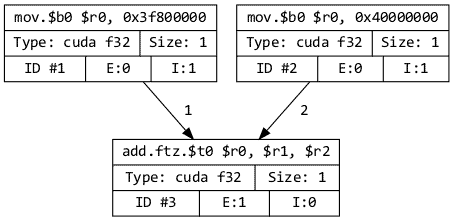

.. cpp:namespace:: enoki

.. _cuda:

Dynamic arrays (CUDA/LLVM)
==========================

The array types discussed so far all operate on fixed-size arrays, such as 3D
vectors or AVX512 packets storing sixteen separate 3D vectors. When the task
at hand involves many more (e.g. millions) of elements, it is often preferable
to work with dynamically sized arrays that can handle vast amounts of data at once.

Available backends
------------------

Enoki provides three different array backends for this purpose:

1. :cpp:struct:`DynamicArray` represents a heap-allocated memory region on the
   CPU not unlike a ``std::vector<T>``. 

   It performs arithmetic in an *eager* fashion, which is simple but generally
   leads to extremely poor performance. This is because each and every
   operation  will allocate a temporary array, load source operands, and store
   the result. The cost of these memory accesses greatly exceeds that of the
   underlying arithmetic operation.

   When working with dynamic arrays, it is generally much better to perform
   arithmetic *lazily*, in which case multiple operations can be *fused*
   together to avoid memory traffic caused by temporary results. And that's
   exactly what the next two options do.

2. :cpp:struct:`CUDAArray` parallelizes computation over all `CUDA
   <https://developer.nvidia.com/cuda-zone>`_ cores of compatible NVIDIA GPUs
   (Maxwell or newer). It does so in a *lazy* fashion: what this means is that
   an arithmetic operation like adding two arrays will not be carried out right
   away.

   Instead, Enoki tries to collect as much work as possible until evaluation
   cannot be postponed anymore (e.g. when the user prints the output of a
   computation). At this point, the system generates an efficient fused CUDA kernel that
   contains a transcript of all steps that are needed to obtain the result.

   This *just-in-time* (JIT) compilation step happens transparently: there is
   no need to hand-write CUDA kernels, or even have CUDA installed, for that
   matter. Enoki will look for the graphics driver at runtime and talk to it
   using NVIDIA's *Parallel Thread Execution* (PTX) intermediate representation.

3. :cpp:struct:`LLVMArray` is very similar to the :cpp:struct:`CUDAArray`
   backend but targets the CPU instead of the GPU. It lazily records operations
   using the `LLVM <https://llvm.org/>`_ intermediate representation and
   generates optimized kernels targeting the host processor. If desired, these
   kernels are also parallelized over all CPU cores, which means that just one
   thread issuing computations involving Enoki arrays can keep a large
   multiprocessor system busy.

   There is no compile-time dependency on LLVM when using this backend. Enoki
   will search for a LLVM shared library at runtime, and any non-ancient
   version > 7.0 works.

The remainder of this page only focuses on the JIT-compiled array types
:cpp:struct:`CUDAArray` and :cpp:struct:`LLVMArray`, generally using the CUDA
variant. Unless noted otherwise, these two are completely exchangeable.
The examples are written in Python, and analogous C++ code can be inferred using
the :ref:`conventions <python-cpp-interface>` relating the two language
interfaces.

Lazy Just-In-Time Compilation
-----------------------------

The following examples illustrate the basic operation of Enoki's JIT compiler.
We begin by importing a CUDA array type through the Python bindings followed by
a basic calculation.

.. code-block:: pycon
   :linenos:

   >>> import enoki as ek
   >>> from enoki.cuda import Float
   >>> a = Float(1) + Float(2)
   >>> print(a)
   [3]

This yields no surprises. What is less obvious is that the computation did
not occur in line 3, but rather in line 4 as part the ``print()`` statement. To
understand what is happening here, we can use the :cpp:func:`graphviz()`
function, which visualizes the queued computation graph associated with a
particular variable:

.. code-block:: pycon

   >>> a = Float(1) + Float(2)
   >>> ek.graphviz(a).view()

The graph here consists of two nodes representing the constant literals
followed by an addition. Each node contains a template of an instruction
expressed in in the `PTX
<https://docs.nvidia.com/cuda/parallel-thread-execution/index.html>`_
intermediate representation, a kind of assembly language that is portable
across NVIDIA GPUs. When the print statement starts to access the array
contents in line 4, this type of lazy execution is no longer possible, at which
point Enoki must *evaluate* the array by compiling and executing a CUDA kernel
containing these three operations. 

Other parts of Enoki work hand-in-hand with these JIT-compiled arrays and lazy
evaluation. For example, evaluating a transcendental function operation from
the built-in math library yields a larger graph containing all necessary
operations (click to magnify):

.. code-block:: pycon

   >>> a = ek.asinh(a)
   >>> ek.graphviz(a).view()

.. image:: cuda-02.png
    :width: 400px
    :align: center

Fusing multiple operations can greatly improve performance because the
intermediate results of a larger calculation can be represented in GPU
registers instead of having access them through global memory. 

Kernel cache
------------

- JIT compiler is fast
- Second step compilation step is slow, but can be avoided
- Size of arrays doesn't matter

Gotchas
-------

Loop with loop counter or similar
Not evaluating computation in loops
leaving referenced arrays lying around

Diagnostics
-----------

Raising log level
ek.whos()

Horizontal reductions
---------------------

Target device
-------------

Automatic differentiation
-------------------------

Caching memory allocator
------------------------

Similar to the `PyTorch memory allocator
<https://pytorch.org/docs/stable/notes/cuda.html#cuda-memory-management>`_,
Enoki uses a caching scheme to avoid very costly device synchronizations when
releasing memory. This means that freeing a large GPU variable doesn't cause
the associated memory region to become available for use by the operating
system or other frameworks like Tensorflow or PyTorch. Use the function
:cpp:func:`cuda_malloc_trim` to fully purge all unused memory. The function is
only relevant when working with other frameworks and does not need to be called
to free up memory for use by Enoki itself.

Low level details
-----------------

CUDA: Grid-stride loop

LLVM: enoki-thread

Usage in C++
------------

Using these array types from C++ requires one of the following three
include directives depending on the desired variant:

.. code-block:: cpp

    #include <enoki/cuda.h>    // <-- For CUDAArray<T>
    #include <enoki/llvm.h>    // <-- For LLVMArray<T>
    #include <enoki/dynamic.h> // <-- For DynamicArray<T>

All of these arrays are composable with other parts of Enoki. For example,
the following type declarations show how to declare a differentiable 3D
array type that will be JIT-compiled to CUDA kernels:

.. code-block:: cpp

    using Float = ek::CUDAArray<float>;
    using FloatD = ek::DiffArray<Float>;
    using Array3f = ek::Array<FloatD, 3>;

.. _custom-cuda:

Enoki ↔ CUDA interoperability
-----------------------------

Enoki's :cpp:struct:`CUDAArray` class dispatches its work to CUDA streams,
making it possible to mix the use of Enoki with standard CUDA kernels. Please
take note of the following points in doing so:

1. CUDA cannot see the effects of computation that has been queued within
   Enoki. Use the :cpp:func:`eval()` function to submit this queued computation
   to the GPU.

2. CUDA kernels run in *streams*: you must submit work to the right stream
   (i.e. the one used by Enoki) to ensure a correct relative ordering of
   operations.

3. C++17 support in NVCC remains limited: it will fail with (incorrect) error
   messages when any Enoki header is included in a file compiled by NVCC. For
   now, it is necessary to partition your project into compilation units
   handled by NVCC and other compilers.

The following example shows what this looks like in practice:

.. code-block:: cpp

   // Forward declaration
   extern void launch_mykernel(cudaStream_t stream, size_t size, const float *in_x,
                               const float *in_y, float *out_x, float *out_y);

   // ...

   using Float   = ek::CUDAArray<float>;
   using Array2f = ek::Array<Float, 2>;

   Array2f in = /* Some Enoki calculation, only symbolic at this point */;

   // Launch CUDA kernel containing queued computation
   ek::eval(in /*, ... other variables ... */);

   // Create empty array (wraps cudaMalloc(), no need to ek::eval() the result)
   Array2f out = ek::empty<Array2f>(1000000);

   // Determine CUDA stream used by Enoki
   cudaStream_t stream = (cudaStream_t) jitc_cuda_stream();

   /// Launch CUDA kernel
   launch_mykernel(
        stream, ek::width(in),
        in.x().data(), in.y().data(),
        out.x().data(), out.y().data()
    );

   // Can now use 'out' in further calculations within Enoki
   out *= 2;

   // Finally, can wrap existing CUDA device pointers into an Enoki array
   float *cuda_device_ptr = ...;
   Float out_2 = ek::map<Float>(cuda_device_ptr,
                                /* # of entries = */ 1000000);

Where the following file containing the kernel is compiled separately by NVCC:

.. code-block:: cpp

    __global__ void my_kernel(size_t size, const float *in_x, const float *in_y,
                              float *out_x, float *out_y) {
        // .. kernel code ..
    }

    // Launcher
    void launch_mykernel(cudaStream_t stream, size_t size, const float *in_x,
                         const float *in_y, float *out_x, float *out_y) {
       my_kernel<<<grid_size, block_size, 0, stream /* <-- important! */>>>(
           size, in_x, in_y, out_x, out_y);
    }

Relationship to other frameworks
--------------------------------

Reference (C++)
---------------

.. cpp:struct:: template <typename Value> DynamicArray : ArrayBase

    This class represents a dynamically sized array using a heap-allocated
    memory region not unlike a ``std::vector<T>``. It it implements all
    arithmetic operations by forwarding them to the underlying ``Value`` type
    and thus behaves like any other Enoki array.

    This class is mainly provided for convenience when storing dynamically
    sized data. It should not be used to perform serious computation, which
    would lead to poor performance. This is because each and every operation
    (e.g. an addition) allocates a new array followed by costly memory reads
    and writes that quickly become the main bottleneck.

.. cpp:struct:: template <typename Value> CUDAArray : ArrayBase

   This array backend just-in-time compiles arithmetic into efficient GPU
   kernels expressed in the CUDA PTX intermediate representation. For details,
   please see the discussion above.

.. cpp:struct:: template <typename Value> LLVMArray : ArrayBase

   This array backend just-in-time compiles arithmetic into efficient CPU
   kernels expressed in the LLVM intermediate representation. For details,
   please see the discussion above.

.. cpp:function:: template <typename Array> const char * graphviz(const Array &array)

   Return GraphViz source code revealing the computation graph associated
   with a particular variable.

.. cpp:function:: template <bool Value, typename Array> auto any_or(const Array &array)

   Test

.. cpp:function:: template <bool Value, typename Array> auto all_or(const Array &array)

   Test

.. cpp:function:: template <bool Value, typename Array> auto none_or(const Array &array)

   Test
