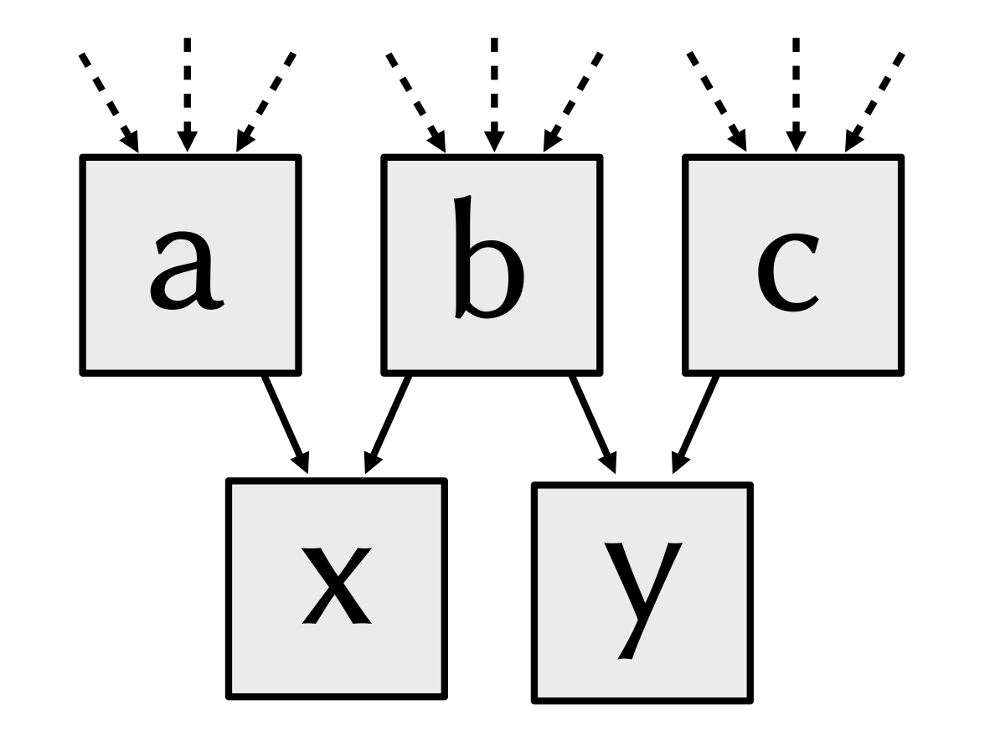
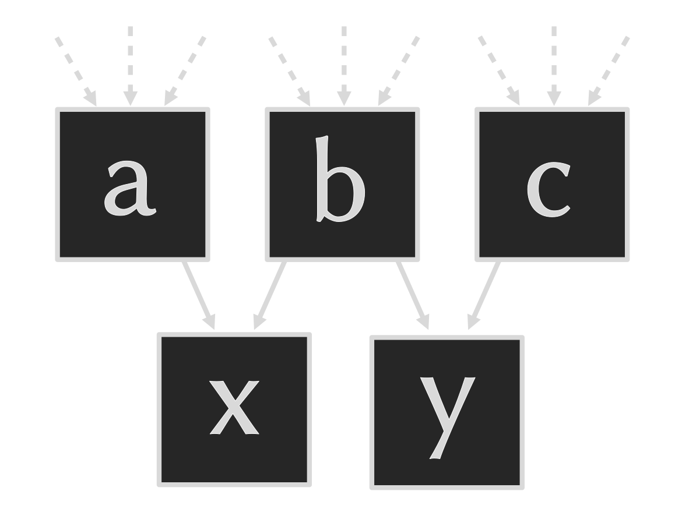
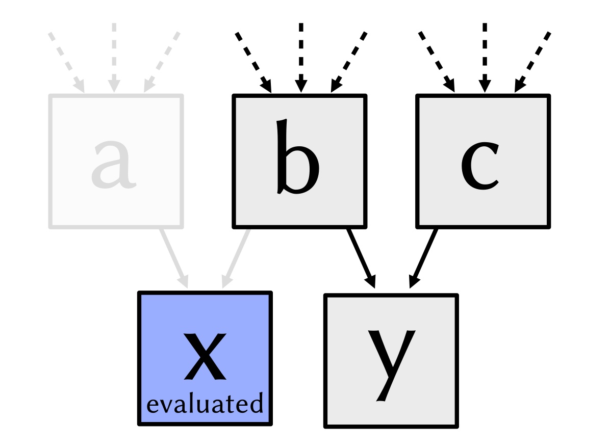
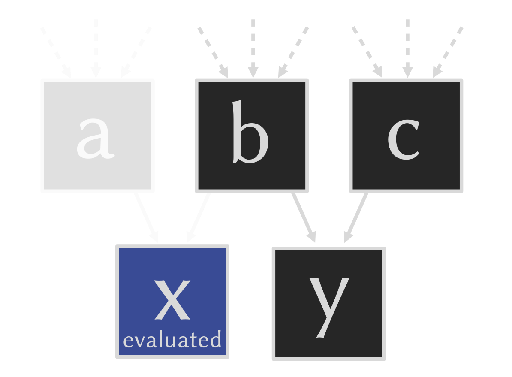

.. py:currentmodule:: drjit

.. _eval:

Evaluation
==========

The previous sections explained how Dr.Jit traces computation for later
evaluation. We now examine what situations trigger this evaluation step,
potential performance pitfalls, and how to take manual control if needed.

Why?
----

Certain operations *simply cannot* be traced. When Dr.Jit encounters them in a
program, they force the system to compile and run a kernel before continuing.

The following operations all exhibit this behavior:

1. **Printing the contents of arrays**: printing requires knowing the actual
   array contents at that moment, hence evaluation can no longer be postponed.
   Here is an example:

   .. code-block:: python

      a = Float(1, 2) + 3 # <-- traced
      print(a)            # <-- evaluated

   (Dr.Jit offers an alternative :py:func:`drjit.print()` statement that can
   print in a delayed fashion to be compatible with tracing.)

2. **Accessing arrays along their trailing dimension**: recall that the
   trailing dimension of Jit-compiled arrays plays a special role, as the
   system uses it to parallelize the computation. Accessing a specific entries
   or gathering along this dimension creates a data dependency that cannot be
   satisfied within the same parallel phase. An example:

   .. code-block:: python

      a = Float(1, 2) + 3 # <-- traced

      b = a[0]            # <-- evaluated
      # or:
      b = dr.gather(Float, source=a, index=UInt32(0)) # <-- also evaluated

   Dr.Jit will split such programs into multiple kernels, which it eagerly does
   by evaluating the source array whenever it detects this type of access.

   Note that it is specifically the trailing dimension that causes this
   behavior. Accesses to components of a nested array type like
   :py:class:`drjit.cuda.Array3f` are unproblematic and can be traced.

   .. code-block:: python

      a = Array3f(1, 2, 3) + 4 # <-- traced
      b = a[0] + a.y           # <-- traced

3. **Side effects**: operations such as :py:func:`drjit.scatter`,
   :py:func:`drjit.scatter_reduce`, etc., modify existing arrays. While such
   operations are traced (i.e. postponed for later evaluation), subsequent
   access of the modified array triggers a variable evaluation. An example:

   .. code-block:: python

      a = dr.empty(Float, 3)
      dr.scatter(target=a, value=Float(0, 1, 2), index=UInt32(2, 1, 0)) # <-- traced
      b = a + 1 # <-- evaluated

   Here, evaluation enforces an ordering constraint that is in general needed
   to ensure correctness in a parallel execution context.

4. **Reductions**: when using an operation such as :py:func:`dr.sum() <sum>` or
   :py:func:`dr.all() <all>` to reduce along the trailing dimension of an array,
   a prior evaluation is required. Some reductions accept an optional
   ``mode="symbolic"`` parameter to postpone evaluation.

5. **Data exchange**: casting Dr.Jit variables into nd-arrays of other
   frameworks (e.g. NumPy, PyTorch, etc.) requires evaluation since these
   libraries cannot represent traced computation.

6. **Manual**: variable evaluation can also be triggered *manually* using the
   operation :py:func:`drjit.eval()`:

   .. code-block:: python

      dr.eval(a)

What does variable evaluation actually do?
------------------------------------------

Suppose that a traced computation has the following dependence structure.

If we now evaluate ``x`` via

.. code-block:: python

   dr.eval(x)

this generates a kernel that also computes the dependent variables ``a`` and
``b``. Executing this kernel turns ``x`` from an *implicit* representation (a
computation graph node) into an *explicit* one (a memory region stored on the
CPU/GPU).

This evaluated ``x`` no longer needs its dependencies---any parts of the
computation graph become unreferenced as a consequence of this are
automatically removed.

Suppose that we now evaluate ``y``:

.. code-block:: python

   dr.eval(y)

This will compile another kernel that also includes the step ``b`` a *second
time*, which causes a small amount of redundancy. To avoid this, we could have
explicitly evaluated ``x`` and ``y`` as part of the same kernel.

.. code-block:: python

   dr.eval(x, y)

Unevaluated arrays merely specify how something can be computed, if needed, and
they do not consume any device memory. In contrast, a large evaluated array can
easily take up gigabytes of device memory. Because of this, some care is often
advisable to avoid unnecessary evaluation.

One evaluated, variables behave exactly the same way in subsequent computations
except that any use in kernels causes them to be *loaded* instead of
*recomputed*.

TODO:

- Careful with indexing (reading/writing scalars)
- Taking control: Evaluate multiple things at once
- Kernel caching

