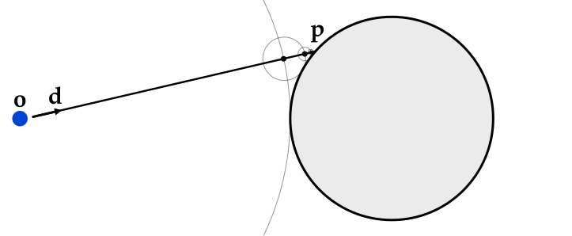
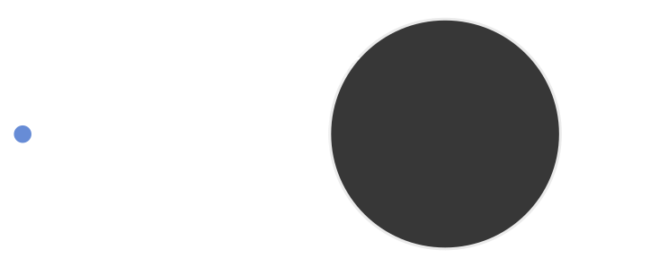
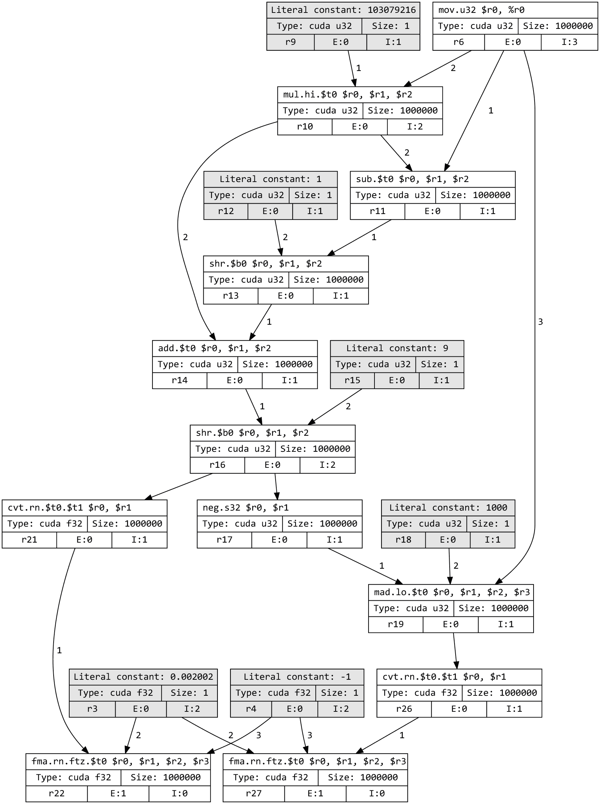
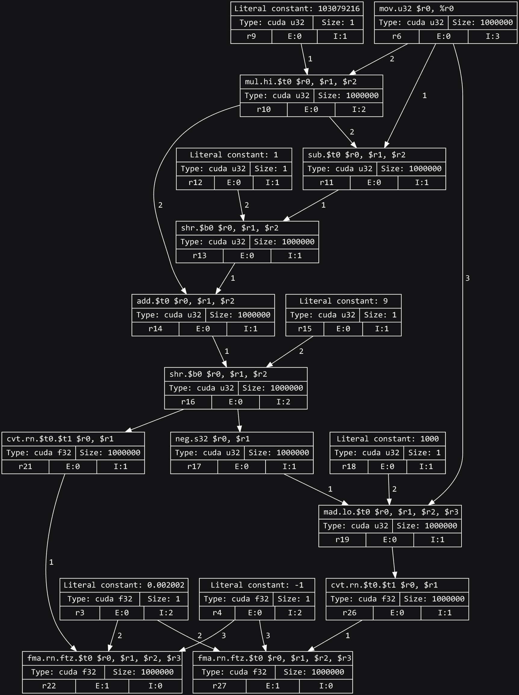
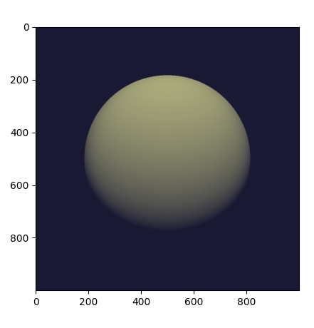
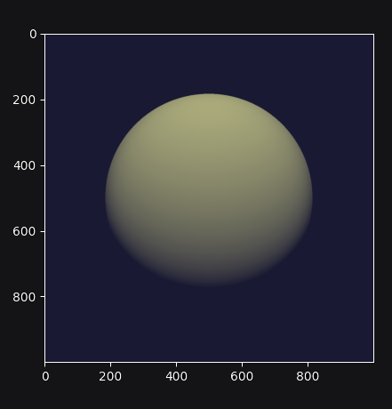
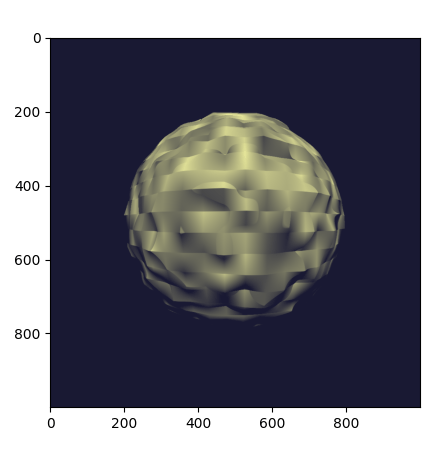
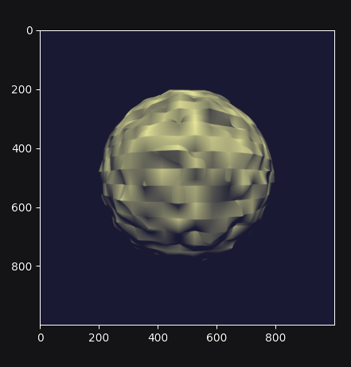
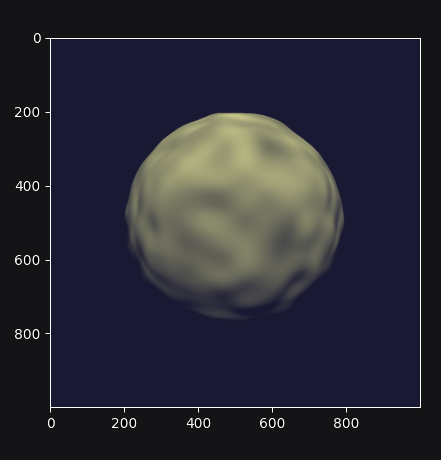

.. py:module:: drjit

.. _firststeps-py:

First steps in Python
=====================

Dr.Jit offers both Python and C++ interfaces. The majority of this
documentation covers the Python interface. For differences that are specific to
C++, see the :ref:`separate section <firststeps-cpp>` on this.

Installing Dr.Jit
-----------------

The easiest way to obtain Dr.Jit is using `binary wheels
<https://realpython.com/python-wheels/>`_, which we provide for officially
supported Python versions and the most common platforms (Linux x86_64,
Windows x86_64, macOS arm64/x86_64). To install Dr.Jit in this way, run

.. code-block:: bash

   $ pip install drjit

The remainder of this section walks through a simple example that makes use of
various system features. In particular, we will render an image of a bumpy
sphere expressed as a `signed distance function
<https://en.wikipedia.org/wiki/Signed_distance_function>`_ using just-in-time
compilation, random number generation, GPU texturing, loop recording, and automatic
differentiation. You can follow the example by copy-pasting code to a python
file or a `Juypter lab
<https://jupyterlab.readthedocs.io/en/stable/getting_started/overview.html>`_
instance (recommended).

Importing Dr.Jit
----------------

Most Dr.Jit functionality resides in the ``drjit`` namespace that we
typically associate with the ``dr`` alias for convenience.

.. code-block:: python

    import drjit as dr

Besides this, we must also choose a set of array types from a specific
computation backend. Several choices are available:

- ``drjit.cuda`` provides data types for GPU-accelerated parallel computing
  using `CUDA <https://en.wikipedia.org/wiki/CUDA>`_.

- ``drjit.llvm`` provides data types for CPU-accelerated parallel computing
  using the `LLVM compiler infrastructure
  <https://en.wikipedia.org/wiki/LLVM>`_.

- ``drjit.scalar`` provides simple data types for serial/scalar computation.

Further backends (e.g. Apple Metal, Intel Xe) are planned in the future. The
CUDA and LLVM backends also provide specialized aliases for derivative tracking
using `automatic differentiation
<https://en.wikipedia.org/wiki/Automatic_differentiation>`_ (``drjit.cuda.ad``
and ``drjit.llvm.ad``). We will discuss them later as part of this tutorial.

We begin by importing various components that will be used in the tutorial:

.. code-block:: python

    from drjit.cuda import Float, UInt32, Array3f, Array2f, TensorXf, Texture3f, PCG32, Loop

LLVM backend
^^^^^^^^^^^^

If you don't have a CUDA-compatible GPU, change ``drjit.cuda`` to
``drjit.llvm`` in the above import statement. In that case, note that LLVM 8
or newer must be installed on the system, which may require additional steps
depending on your platform:

- **Linux**: ``apt-get install llvm`` (or an equivalent command for your distribution.)

- **macOS**: ``brew install llvm`` using `Homebrew <https://brew.sh>`_.

- **Windows**: run one of the `official installers
  <https://releases.llvm.org>`_ (many files can be downloaded from this page,
  look for ones with the pattern ``LLVM-<version>-win64.exe``). It is important
  that you let the installer adjust the ``%PATH%`` variable so that the file
  ``LLVM-C.dll`` can be found by Dr.Jit.

With that out of the way, let's get back to the example.

Signed distance functions and sphere tracing
--------------------------------------------

A `signed distance function
<https://en.wikipedia.org/wiki/Signed_distance_function>`_ is a function that
specifies the distance to the nearest surface. It provides a convenient and
general way of encoding 3D shape information. We will initially start with a
simple SDF of a sphere with radius 1 that is centered around the origin:

.. code-block:: python

    def sdf(p: Array3f) -> Float:
        return dr.norm(p) - 1

The function takes 3D points and returns the associated distance value. The
type annotations are provided for clarity and can be omitted in practice. We
can use an interactive Python prompt to pass an ``Array3f`` instance
representing a 3D point into the function and observe the calculated distance.

.. code-block:: pycon

    >>> sdf(Array3f(1, 2, 3))
    [2.7416574954986572]

The CUDA and LLVM backends of Dr.Jit *vectorize* and *parallelize* computation.
This means that types like ``Float`` and ``Array3f`` typically hold many values
at once that are used to perform simultaneous evaluations of a function. For
example, we can compute the SDF at positions :math:`(0, 0, 0)` and :math:`(1,
2, 3)` in one combined step.

.. code-block:: pycon

    >>> sdf(Array3f([0, 1], [0, 2], [0, 3]))
    [-1.0, 2.7416574954986572]

To visualize the surface encoded by the SDF, we will use an algorithm called
`sphere tracing
<https://graphics.stanford.edu/courses/cs348b-20-spring-content/uploads/hart.pdf>`_.
Given a ray with an origin :math:`\textbf{o}` and direction :math:`\textbf{d}`,
sphere tracing evaluates :math:`\mathrm{sdf}(\textbf{o})` to find the distance
of the nearest surface. The line segment connecting :math:`\textbf{o}` and
:math:`\mathbf{o} + \mathbf{d}\cdot\mathrm{sdf}(\textbf{o})` is free of
surfaces by construction, and the algorithm thus skips to the end of this
interval. Further repetition of this recipe causes the method to either
approach the nearest surface intersection :math:`\textbf{p}` (visualized below)
or escape to infinity.

   light

The following sphere tracer runs for 10 fixed iteration and lacks various
common optimizations for simplicity. The function :py:func:`fma` performs a
*fused multiply-add*, i.e., it evaluates ``fma(a, b, c) = a*b + c`` with
reduced rounding error and better performance.

.. code-block:: python

    def trace(o: Array3f, d: Array3f) -> Array3f:
        for i in range(10):
            o = dr.fma(d, sdf(o), o)
        return o

So far, so good. Now suppose ``p = trace(o, d)`` finds an intersection
``p``. To use this information to create an image, we must *shade* it (i.e.,
assign an intensity value).

Many different shading models exist; a simple approach is to compute inner
product of the *surface normal* and the direction :math:`\mathbf{l}` towards a
light source. Intuitively, the surface becomes brighter as it more directly
faces the light source. In the case of a signed distance function, the surface
normal at :math:`\mathbf{p}` is given by the gradient vector :math:`\nabla
\mathrm{sdf}(\mathbf{p})` so that this shading model entails computing

.. math::

   \mathrm{max}\{0, \nabla \mathrm{sdf}(\mathbf{p}) \cdot \mathbf{l}\}

The gradient can be estimated using central `finite differences
<https://en.wikipedia.org/wiki/Finite_difference>`_ with step size
``eps=1e-3``, which yields the following rudimentary shading routine (we
will improve upon it shortly).

.. code-block:: python

    def shade(p: Array3f, l: Array3f, eps: float = 1e-3) -> Float:
        n = Array3f(
            sdf(p + [eps, 0, 0]) - sdf(p - [eps, 0, 0]),
            sdf(p + [0, eps, 0]) - sdf(p - [0, eps, 0]),
            sdf(p + [0, 0, eps]) - sdf(p - [0, 0, eps])
        ) / (2 * eps)
        return dr.maximum(0, dr.dot(n, l))

To create an image, we must generate a set of rays that will be processed by
these functions. We begin by creating a ``Float`` array with 1000 linearly
spaced elements covering the interval :math:`[-1, 1]` and then expand this into
a set of :math:`1000\times 1000` :math:`x` and :math:`y` grid coordinates. The
:py:func:`linspace` and :py:func:`meshgrid` functions resemble their eponymous
counterparts in array programming libraries like NumPy.

.. code-block:: python

    x = dr.linspace(Float, -1, 1, 1000)
    x, y = dr.meshgrid(x, x)

This is a good point for a small digression to explain a major difference to
tools like NumPy.

Tracing and delayed evaluation
------------------------------

In most array programming frameworks, the previous two commands would have
created arrays representing actual data (grid coordinates in this example).

Dr.Jit uses a different approach termed *tracing* to delay the evaluation of
computation. In particular, no arithmetic took place during the two preceding
steps: instead, Dr.Jit recorded a graph representing the sequence of steps that
are needed to *eventually* compute ``x`` and ``y`` (which are represented by
the bottom two nodes in the visualization below).

.. note::

    To view a computation graph like this on your own machine, you must install
    `GraphViz <https://graphviz.org>`_ on your system along with the `graphviz
    <https://pypi.org/project/graphviz/>`_ Python package. Following this, you
    can run ``dr.graphviz().view()``.

It is clear that the evaluation can not be postponed arbitrarily: we will
eventually want to look at the generated image. At this point, Dr.Jit will take
all recorded steps, compile them into an optimized *kernel*, and run it on the
GPU or CPU. This all happens transparently behind the scenes.

What are the benefits of doing things in this way? Merging multiple steps of a
computation into a kernel (often called *fusion*) means that these steps can
exchange information using fast register memory. This allows them to spend more
time on the actual computation as opposed to reading and writing main memory
(which is slow). Tracing also opens up other optimization opportunities
explained in the `paper and video
<https://rgl.epfl.ch/publications/Jakob2022DrJit>`_ explaining the system's
design. Dr.Jit can trace enormously large programs without interruption and use
the graph representation to simplify them.

Example, continued
------------------

We will now use the previously computed grid points to define a virtual camera
plane with pixel positions :math:`(x, y, 1)` relative to a pinhole at
:math:`(0, 0, -2)` and simultaneously perform sphere tracing along every
associated ray.

.. code-block:: python

    p = trace(o=Array3f(0, 0, -2),
              d=dr.normalize(Array3f(x, y, 1)))

Next, we can shade the intersected points for light arriving from direction
:math:`(0, -1, -1)`. Note the *masked assignment* at the bottom, which disables
shading for rays that did not intersect anything.

.. code-block:: python

    sh = shade(p, l=Array3f(0, -1, -1))
    sh[sdf(p) > .1] = 0

We multiply and offset the shaded value with an ambient and highlight color.
The resulting variable ``img`` associates an RGB color value with every pixel.

.. code-block:: python

    img = Array3f(.1, .1, .2) + Array3f(.4, .4, .2) * sh

If you are used to array programming frameworks like NumPy/PyTorch, it may be
tempting to think of ``img`` as a tensor that points to a ``3xN`` or
``Nx3``-shaped block of memory (where ``N`` is the pixel count).

Dr.Jit instead traces computation for delayed evaluation, which means that no
actual computation has occurred so far. The 3D array ``img`` (type
:py:class:`drjit.cuda.Array3f`) consists of 3 components (``img.x``, ``img.y``,
and ``img.z``) of type :py:class:`drjit.cuda.Float`, of which each represents
an intermediate variable within a steadily growing program of the following
high-level structure.

.. code-block:: python

    # For illustration only, not part of the running example

    for i in range(1000000): # (in parallel)
        # .. earlier steps ..
        img_x = .1 + .4 * sh
        img_y = .1 + .4 * sh
        img_z = .2 + .2 * sh

This program performs a parallel loop over :math:`1000\times1000` pixels.
Subsequent Dr.Jit operations will simply add further steps to this program. For
example, we can invoke :py:func:`ravel` to flatten the 3D array into a
:py:class:`drjit.cuda.Float` array.

.. code-block:: python

    img_flat = dr.ravel(img)

Conceptually, this adds three more lines to the program

.. code-block:: python

    # For illustration only, not part of the running example

    for i in range(1000000): # (in parallel)
        # .. earlier steps ..
        img_flat[i*3 + 0] = img_x
        img_flat[i*3 + 1] = img_y
        img_flat[i*3 + 2] = img_z

This is essentially *metaprogramming*: running the program generates *another*
program that will run at some later point and perform the actual computation.
This all happens automatically and is key to the efficiency of Dr.Jit.

Dr.Jit also supports arbitrarily sized tensors of various types (for example,
:py:class:`drjit.cuda.TensorXf` for a CUDA ``float32`` tensor). Tensors are
useful for *data exchange* with other array programming frameworks. For
example, we can reshape the flat image buffer into a :math:`1000\times
1000\times 3` image tensor and then visualize it using `matplotlib
<https://matplotlib.org>`_.

.. code-block:: python

    img_t = TensorXf(img_flat, shape=(1000, 1000, 3))

    import matplotlib.pyplot as plt
    plt.imshow(img_t)
    plt.show()

.. warning::

    Despite the presence of a tensor type, Dr.Jit is *not* a tensor/array
    programming library. Heavy use of tensor operations like slice-based
    indexing may lead to poor performance, since they impede Dr.Jit's
    ability to *fuse* many operations into large kernels.

    Programs should be mainly written in terms of 1D arrays
    (:py:class:`drjit.cuda.Float`, :py:class:`drjit.cuda.UInt32`,
    :py:class:`drjit.cuda.Int64`, etc.) and fixed-size combinations. For
    example, :py:class:`drjit.cuda.Matrix4f` wraps :math:`4\times 4=16`
    :py:class:`drjit.cuda.Float` instances, each of which represents
    a variable in the program.

The line ``plt.imshow(img_t)`` will access the image contents, and it is at
this point that the traced program runs on the GPU, producing the following
output:

.. admonition:: Complete example code up to this point.
   :class: dropdown

    .. code-block:: python

        import drjit as dr
        from drjit.cuda import Float, UInt32, Array3f, Array2f, TensorXf, Texture3f, PCG32, Loop

        def sdf(p: Array3f) -> Float:
            return dr.norm(p) - 1

        def trace(o: Array3f, d: Array3f) -> Array3f:
            for i in range(10):
                o = dr.fma(d, sdf(o), o)
            return o

        def shade(p: Array3f, l: Array3f, eps: float = 1e-3) -> Float:
            n = Array3f(
                sdf(p + [eps, 0, 0]) - sdf(p - [eps, 0, 0]),
                sdf(p + [0, eps, 0]) - sdf(p - [0, eps, 0]),
                sdf(p + [0, 0, eps]) - sdf(p - [0, 0, eps])
            ) / (2 * eps)
            return dr.maximum(0, dr.dot(n, l))

        x = dr.linspace(Float, -1, 1, 1000)
        x, y = dr.meshgrid(x, x)

        p = trace(o=Array3f(0, 0, -2),
                  d=dr.normalize(Array3f(x, y, 1)))

        sh = shade(p, l=Array3f(0, -1, -1))
        sh[sdf(p) > .1] = 0

        img = Array3f(.1, .1, .2) + Array3f(.4, .4, .2) * sh
        img_flat = dr.ravel(img)

        img_t = TensorXf(img_flat, shape=(1000, 1000, 3))

        import matplotlib.pyplot as plt
        plt.imshow(img_t)
        plt.show()

Textures, random number generation
----------------------------------

This previous example was a little bland—let's make it more interesting!
We will deform the sphere by perturbing the implicitly defined surface with
a noise function.

Dr.Jit was originally designed for `Monte Carlo methods
<https://en.wikipedia.org/wiki/Monte_Carlo_method>`_ that heavily rely on
random sampling, and it ships with Melissa O'Neill's `PCG32
<https://www.pcg-random.org/index.html>`_ pseudorandom number generator to
help with such applications.

Here, we use PCG32 to generate a relatively small set of uniformly distributed
variates covering the interval :math:`[0, 1]`.

.. code-block:: python

    noise = PCG32(size=16*16*16).next_float32()

We can then create a noise texture from these uniform variates. The command
below allocates a 3D texture with a resolution of :math:`16\times16\times 16`
and :math:`1` color channel.

.. code-block:: python

    noise_tex = Texture3f(TensorXf(noise, shape=(16, 16, 16, 1)))

We finally replace the ``sdf()`` function with a modified version that
evaluates the texture with an offset and scaled value of ``p`` to slightly
perturb the level set. This uses the GPU texture units on the CUDA backend and
a software-interpolated lookup in the LLVM backend.

.. code-block:: python

    def sdf(p: Array3f) -> Float:
        sdf_value = dr.norm(p) - 1
        sdf_value += noise_tex.eval(dr.fma(p, 0.5,  0.5))[0] * 0.1
        return sdf_value

Let us also add the following line at the beginning of the program, which
causes Dr.Jit to emit a brief message whenever it compiles and runs a kernel.

.. code-block:: python

    dr.set_log_level(dr.LogLevel.Info)

Re-running the program produces the following output:

Why does it look so *faceted*? The texture uses trilinear interpolation, and
the surface normal is given by the *derivative* of the interpolant (meaning
that it will be *piecewise constant*). Dr.Jit also provides higher-order
tricubic interpolation that internally reduces to eight hardware-accelerated
texture lookups. We can use it to redefined ``sdf()`` once more:

.. code-block:: python

    def sdf(p: Array3f) -> Float:
        sdf_value = dr.norm(p) - 1
        sdf_value += noise_tex.eval_cubic(dr.fma(p, 0.5,  0.5))[0] * 0.1
        return sdf_value

With this implementation, we obtain a smooth bumpy sphere.

.. admonition:: Complete example code up to this point.
   :class: dropdown

    .. code-block:: python

        import drjit as dr
        from drjit.cuda import Float, UInt32, Array3f, Array2f, TensorXf, Texture3f, PCG32, Loop

        dr.set_log_level(dr.LogLevel.Info)

        noise = PCG32(size=16*16*16).next_float32()
        noise_tex = Texture3f(TensorXf(noise, shape=(16, 16, 16, 1)))

        def sdf(p: Array3f) -> Float:
            sdf_value = dr.norm(p) - 1
            sdf_value += noise_tex.eval_cubic(dr.fma(p, 0.5,  0.5))[0] * 0.1
            return sdf_value

        def trace(o: Array3f, d: Array3f) -> Array3f:
            for i in range(10):
                o = dr.fma(d, sdf(o), o)
            return o

        def shade(p: Array3f, l: Array3f, eps: float = 1e-3) -> Float:
            n = Array3f(
                sdf(p + [eps, 0, 0]) - sdf(p - [eps, 0, 0]),
                sdf(p + [0, eps, 0]) - sdf(p - [0, eps, 0]),
                sdf(p + [0, 0, eps]) - sdf(p - [0, 0, eps])
            ) / (2 * eps)
            return dr.maximum(0, dr.dot(n, l))

        x = dr.linspace(Float, -1, 1, 1000)
        x, y = dr.meshgrid(x, x)

        p = trace(o=Array3f(0, 0, -2),
                  d=dr.normalize(Array3f(x, y, 1)))

        sh = shade(p, l=Array3f(0, -1, -1))
        sh[sdf(p) > .1] = 0

        img = Array3f(.1, .1, .2) + Array3f(.4, .4, .2) * sh
        img_flat = dr.ravel(img)

        img_t = TensorXf(img_flat, shape=(1000, 1000, 3))

        import matplotlib.pyplot as plt
        plt.imshow(img_t)
        plt.show()

Kernel launches, caching
------------------------

Besides generating an image, the last experiment also produced several log
messages enabled by the call to :py:func:`dr.set_log_level()`.

.. code-block:: pycon
    :emphasize-lines: 2, 3, 6, 7

    jit_eval(): launching 1 kernel.
      -> launching 17509add1324abde (n=4096, in=0, out=1, ops=41, jit=15.073 us):
         cache miss, build: 576.932 us, 3.375 KiB.
    jit_eval(): done.
    jit_eval(): launching 1 kernel.
      -> launching 87908afce75f85b5 (n=1000000, in=5, out=0, se=3, ops=2114, jit=330.965 us):
         cache miss, build: 1.17021 ms, 30.38 KiB.
    jit_eval(): done.

Several things are noteworthy here:

- Dr.Jit launched *two* kernels: the first one to compute the noise texture
  with ``n=4096`` texels, followed by the main rendering step that computed
  ``n=1000000`` image pixels.

- The second kernel is *big* and contains over two thousand operations (``ops=2114``).

- It generated those kernels for the first time (``cache miss``) and so had to
  perform a somewhat expensive compilation step to generate machine code.

  If you re-run the example a second time, this part of the message will change
  to ``cache hit``, and the compilation is skipped. Dr.Jit stores cached
  kernels on disk in the ``~/.drjit`` directory on Linux/macOS, and in
  ``~/AppData/Local/Temp/drjit`` on Windows. Dr.Jit was originally
  designed to accelerate gradient-based optimization; caching is particularly
  useful in this context, since the expensive compilation step will only run
  once during the first gradient step.

- If you are using the LLVM backend, the kernel will be even larger..

  .. code-block:: pycon
      :emphasize-lines: 2, 3

      jit_eval(): launching 1 kernel.
        -> launching 6e8cadb52477dd91 (n=1000000, in=5, out=0, se=3, ops=7560, jit=2.92385 ms):
           cache miss, build: 2.411 s, 78.25 KiB.
      jit_eval(): done.

  The CPU does not have hardware texturing instructions and must emulate them,
  which causes this size increase to over 7K instructions. While tracing is
  fast (2.9 milliseconds), the one-time compilation step now takes almost 2.5
  seconds!

What leads to these large kernels? Not only does the bumpy sphere SDF generate
more code: Dr.Jit's computation graph also contains it a whopping 17 times: 10
times for sphere tracing steps, 6 times for finite differences-based normal
computation, and one final time for the masked assignment that disables pixels
without valid intersections. This doesn't seem like a good way of using the
system—let's improve the example!

Recorded loops
--------------

A first inefficiency is that a normal Python ``for`` loop will unroll the loop
many times, producing an unnecessarily large trace that is expensive to
compile. It is also inflexible: there is no easy way to to stop the sphere
tracing iteration early when it is sufficiently close to the surface.

Dr.Jit provides a *recorded loop* primitive to address these and related
limitations. To use it, replace the earlier sphere tracing implementation

.. code-block:: python

    # Old version
    def trace(o: Array3f, d: Array3f) -> Array3f:
        for i in range(10):
            o = dr.fma(d, sdf(o), o)
        return o

by the following improved version:

.. code-block:: python

    # Improved version
    def trace(o: Array3f, d: Array3f) -> Array3f:
        i = UInt32(0)
        loop = Loop("Sphere tracing", lambda: (o, i))
        while loop(i < 10):
            o = dr.fma(d, sdf(o), o)
            i += 1
        return o

Expressed in this form, Dr.Jit will only trace the body *once* and make note of
the fact that it must loop on the device while the condition ``i < 10`` holds.
The condition is itself a Dr.Jit array, and elements can therefore run the loop
for different numbers of iterations.

For this all to work correctly, Dr.Jit needs to know what variables are
modified by the loop body. The ``lambda: (o, i)`` parameter serves this role
and allows the system to detect when variables are changed or entirely
overwritten. The label ``"Sphere tracing"`` will be added to generated PTX/LLVM
code and can be helpful when looking at kernels of programs containing many
loops. This simple change reduces the operation count to half.

Automatic differentiation
-------------------------

Next, we can examine the ``shade()`` method that evaluated the SDF 6 times to
compute an approximate derivative, which was a source of inefficiency:

.. code-block:: python

    # Old version
    def shade(p: Array3f, l: Array3f, eps: float = 1e-3) -> Float:
        n = Array3f(
            sdf(p + [eps, 0, 0]) - sdf(p - [eps, 0, 0]),
            sdf(p + [0, eps, 0]) - sdf(p - [0, eps, 0]),
            sdf(p + [0, 0, eps]) - sdf(p - [0, 0, eps])
        ) / (2 * eps)
        return dr.maximum(0, dr.dot(n, l))

Dr.Jit includes an `automatic differentiation
<https://en.wikipedia.org/wiki/Automatic_differentiation>`_ layer to
analytically differentiate expressions, producing code that is more efficient
*and* more accurate. To use the AD layer, simple append ``.ad`` to the import
directive at the top of the program. For example for the CUDA backend, you
would write:

.. code-block:: python

    from drjit.cuda.ad import Float, UInt32, Array3f, Array2f, TensorXf, Texture3f, PCG32, Loop

There is essentially no extra cost for using types from the ``.ad`` namespace
when gradient tracking isn't explicitly enabled for a variable, so you can
simply use them everywhere by default.

The AD version of ``shade()`` invokes :py:func:`drjit.enable_grad()` to track
the differential dependence of subsequent variables on the position ``p``. It
subsequently evaluates the SDF just once, which records the structure of the
computation into a graph representation. The next two lines set an input
gradient at ``p`` and propagate the derivative to the output ``value``, which
results in the desired directional derivative :math:`\nabla
\mathrm{sdf}(\mathbf{p}) \cdot \mathbf{l}`.

.. code-block:: python

    # Improved version
    def shade(p: Array3f, l: Array3f) -> Float:
        dr.enable_grad(p)
        value = sdf(p)
        dr.set_grad(p, l)
        dr.forward_to(value)
        return dr.maximum(0, dr.grad(value))

The :py:func:`dr.forward_to()` call materializes the AD-based
derivatives into ordinary computation that is traced along with
the rest of the program.

This reduces the operation count by another factor of 2, and compilation
time is now consistently between 30-90 milliseconds across backends.

.. admonition:: Complete example code including optimizations
   :class: dropdown

    .. code-block:: python

        import drjit as dr
        from drjit.cuda.ad import Float, UInt32, Array3f, Array2f, TensorXf, Texture3f, PCG32, Loop

        dr.set_log_level(dr.LogLevel.Info)

        noise = PCG32(size=16*16*16).next_float32()
        noise_tex = Texture3f(TensorXf(noise, shape=(16, 16, 16, 1)))

        def sdf(p: Array3f) -> Float:
            sdf_value = dr.norm(p) - 1
            sdf_value += noise_tex.eval_cubic(dr.fma(p, 0.5,  0.5))[0] * 0.1
            return sdf_value

        def trace(o: Array3f, d: Array3f) -> Array3f:
            i = UInt32(0)
            loop = Loop("Sphere tracing", lambda: (o, i))
            while loop(i < 10):
                o = dr.fma(d, sdf(o), o)
                i += 1
            return o

        def shade(p: Array3f, l: Array3f, eps: float = 1e-3) -> Float:
            dr.enable_grad(p)
            value = sdf(p);
            dr.set_grad(p, l)
            dr.forward_to(value)
            return dr.maximum(0, dr.grad(value))

        x = dr.linspace(Float, -1, 1, 1000)
        x, y = dr.meshgrid(x, x)

        p = trace(o=Array3f(0, 0, -2),
                  d=dr.normalize(Array3f(x, y, 1)))

        sh = shade(p, l=Array3f(0, -1, -1))
        sh[sdf(p) > .1] = 0

        img = Array3f(.1, .1, .2) + Array3f(.4, .4, .2) * sh
        img_flat = dr.ravel(img)

        img_t = TensorXf(img_flat, shape=(1000, 1000, 3))

        import matplotlib.pyplot as plt
        plt.imshow(img_t)
        plt.show()

Dr.Jit can propagate derivatives in forward mode (shown here) and reverse mode,
which is useful for gradient-based optimization of programs with many inputs.

This concludes the running example. For those interested in the nitty-gritty
details and quality of the generated code, we include an example of the PTX
output produced by Dr.Jit below.

.. admonition:: PTX intermediate representation produced by this example
   :class: dropdown

    .. code-block:: asm

        .version 6.0
        .target sm_60
        .address_size 64

        .entry drjit_b6460a9f61ed83ee22ab62b4db19ee5b(.param .align 8 .b8 params[48]) {
            .reg.b8   %b <398>; .reg.b16 %w<398>; .reg.b32 %r<398>;
            .reg.b64  %rd<398>; .reg.f32 %f<398>; .reg.f64 %d<398>;
            .reg.pred %p <398>;

            mov.u32 %r0, %ctaid.x;
            mov.u32 %r1, %ntid.x;
            mov.u32 %r2, %tid.x;
            mad.lo.u32 %r0, %r0, %r1, %r2;
            ld.param.u32 %r2, [params];
            setp.ge.u32 %p0, %r0, %r2;
            @%p0 bra done;

            mov.u32 %r3, %nctaid.x;
            mul.lo.u32 %r1, %r3, %r1;

        body: // sm_75
            ld.param.u64 %rd0, [params+8];
            ldu.global.u32 %r4, [%rd0];
            ld.param.u64 %rd0, [params+16];
            ldu.global.u32 %r5, [%rd0];
            ld.param.u64 %rd0, [params+24];
            ldu.global.u32 %r6, [%rd0];
            ld.param.u64 %rd7, [params+32];
            mov.b32 %f8, 0x3b033405;
            mov.b32 %f9, 0xbf800000;
            mov.u32 %r10, %r0;
            mov.b32 %r11, 0x624dd30;
            mul.hi.u32 %r12, %r11, %r10;
            sub.u32 %r13, %r10, %r12;
            mov.b32 %r14, 0x1;
            shr.b32 %r15, %r13, %r14;
            add.u32 %r16, %r15, %r12;
            mov.b32 %r17, 0x9;
            shr.b32 %r18, %r16, %r17;
            neg.s32 %r19, %r18;
            mov.b32 %r20, 0x3e8;
            mad.lo.u32 %r21, %r19, %r20, %r10;
            cvt.rn.f32.u32 %f22, %r18;
            fma.rn.ftz.f32 %f23, %f22, %f8, %f9;
            cvt.rn.f32.u32 %f24, %r21;
            fma.rn.ftz.f32 %f25, %f24, %f8, %f9;
            mov.b32 %f26, 0x0;
            mov.b32 %f27, 0xc0000000;
            mov.b32 %f28, 0x3f800000;
            mul.ftz.f32 %f29, %f25, %f25;
            fma.rn.ftz.f32 %f30, %f23, %f23, %f29;
            add.ftz.f32 %f31, %f28, %f30;
            rsqrt.approx.ftz.f32 %f32, %f31;
            mul.ftz.f32 %f33, %f25, %f32;
            mul.ftz.f32 %f34, %f23, %f32;
            mov.b32 %r35, 0x0;
            // Loop (Sphere tracing) [in 0, cond]
            mov.f32 %f36, %f26;
            // Loop (Sphere tracing) [in 1, cond]
            mov.f32 %f37, %f26;
            // Loop (Sphere tracing) [in 2, cond]
            mov.f32 %f38, %f27;
            // Loop (Sphere tracing) [in 3, cond]
            mov.u32 %r39, %r35;

        l_40_cond: // Loop (Sphere tracing)
            mov.b32 %r41, 0xa;
            setp.lo.u32 %p42, %r39, %r41;
            @!%p42 bra l_40_done;

        l_40_body:
            // Loop (Sphere tracing) [in 0, body]
            mov.f32 %f44, %f36;
            // Loop (Sphere tracing) [in 1, body]
            mov.f32 %f45, %f37;
            // Loop (Sphere tracing) [in 2, body]
            mov.f32 %f46, %f38;
            // Loop (Sphere tracing) [in 3, body]
            mov.u32 %r47, %r39;
            mul.ftz.f32 %f48, %f44, %f44;
            fma.rn.ftz.f32 %f49, %f45, %f45, %f48;
            fma.rn.ftz.f32 %f50, %f46, %f46, %f49;
            sqrt.approx.ftz.f32 %f51, %f50;
            mov.b32 %f52, 0x3f800000;
            sub.ftz.f32 %f53, %f51, %f52;
            mov.b32 %f54, 0x3f000000;
            fma.rn.ftz.f32 %f55, %f44, %f54, %f54;
            fma.rn.ftz.f32 %f56, %f45, %f54, %f54;
            fma.rn.ftz.f32 %f57, %f46, %f54, %f54;
            mov.pred %p58, 0x1;
            cvt.rn.f32.u32 %f59, %r6;
            cvt.rn.f32.u32 %f60, %r5;
            cvt.rn.f32.u32 %f61, %r4;
            mov.b32 %f62, 0xbf000000;
            fma.rn.ftz.f32 %f63, %f55, %f59, %f62;
            fma.rn.ftz.f32 %f64, %f56, %f60, %f62;
            fma.rn.ftz.f32 %f65, %f57, %f61, %f62;
            cvt.rmi.f32.f32 %f66, %f63;
            cvt.rzi.s32.f32 %r67, %f66;
            cvt.rmi.f32.f32 %f68, %f64;
            cvt.rzi.s32.f32 %r69, %f68;
            cvt.rmi.f32.f32 %f70, %f65;
            cvt.rzi.s32.f32 %r71, %f70;
            cvt.rn.f32.s32 %f72, %r67;
            cvt.rn.f32.s32 %f73, %r69;
            cvt.rn.f32.s32 %f74, %r71;
            sub.ftz.f32 %f75, %f63, %f72;
            sub.ftz.f32 %f76, %f64, %f73;
            sub.ftz.f32 %f77, %f65, %f74;
            rcp.approx.ftz.f32 %f78, %f59;
            rcp.approx.ftz.f32 %f79, %f60;
            rcp.approx.ftz.f32 %f80, %f61;
            mul.ftz.f32 %f81, %f75, %f75;
            mul.ftz.f32 %f82, %f81, %f75;
            mov.b32 %f83, 0x3e2aaaab;
            neg.ftz.f32 %f84, %f82;
            mov.b32 %f85, 0x40400000;
            mul.ftz.f32 %f86, %f85, %f81;
            add.ftz.f32 %f87, %f84, %f86;
            mul.ftz.f32 %f88, %f85, %f75;
            sub.ftz.f32 %f89, %f87, %f88;
            add.ftz.f32 %f90, %f89, %f52;
            mul.ftz.f32 %f91, %f90, %f83;
            mul.ftz.f32 %f92, %f85, %f82;
            mov.b32 %f93, 0x40c00000;
            mul.ftz.f32 %f94, %f93, %f81;
            sub.ftz.f32 %f95, %f92, %f94;
            mov.b32 %f96, 0x40800000;
            add.ftz.f32 %f97, %f95, %f96;
            mul.ftz.f32 %f98, %f97, %f83;
            mul.ftz.f32 %f99, %f82, %f83;
            add.ftz.f32 %f100, %f91, %f98;
            sub.ftz.f32 %f101, %f52, %f100;
            sub.ftz.f32 %f102, %f72, %f54;
            div.approx.ftz.f32 %f103, %f98, %f100;
            add.ftz.f32 %f104, %f102, %f103;
            mul.ftz.f32 %f105, %f104, %f78;
            mov.b32 %f106, 0x3fc00000;
            add.ftz.f32 %f107, %f72, %f106;
            div.approx.ftz.f32 %f108, %f99, %f101;
            add.ftz.f32 %f109, %f107, %f108;
            mul.ftz.f32 %f110, %f109, %f78;
            mul.ftz.f32 %f111, %f76, %f76;
            mul.ftz.f32 %f112, %f111, %f76;
            neg.ftz.f32 %f113, %f112;
            mul.ftz.f32 %f114, %f85, %f111;
            add.ftz.f32 %f115, %f113, %f114;
            mul.ftz.f32 %f116, %f85, %f76;
            sub.ftz.f32 %f117, %f115, %f116;
            add.ftz.f32 %f118, %f117, %f52;
            mul.ftz.f32 %f119, %f118, %f83;
            mul.ftz.f32 %f120, %f85, %f112;
            mul.ftz.f32 %f121, %f93, %f111;
            sub.ftz.f32 %f122, %f120, %f121;
            add.ftz.f32 %f123, %f122, %f96;
            mul.ftz.f32 %f124, %f123, %f83;
            mul.ftz.f32 %f125, %f112, %f83;
            add.ftz.f32 %f126, %f119, %f124;
            sub.ftz.f32 %f127, %f52, %f126;
            sub.ftz.f32 %f128, %f73, %f54;
            div.approx.ftz.f32 %f129, %f124, %f126;
            add.ftz.f32 %f130, %f128, %f129;
            mul.ftz.f32 %f131, %f130, %f79;
            add.ftz.f32 %f132, %f73, %f106;
            div.approx.ftz.f32 %f133, %f125, %f127;
            add.ftz.f32 %f134, %f132, %f133;
            mul.ftz.f32 %f135, %f134, %f79;
            mul.ftz.f32 %f136, %f77, %f77;
            mul.ftz.f32 %f137, %f136, %f77;
            neg.ftz.f32 %f138, %f137;
            mul.ftz.f32 %f139, %f85, %f136;
            add.ftz.f32 %f140, %f138, %f139;
            mul.ftz.f32 %f141, %f85, %f77;
            sub.ftz.f32 %f142, %f140, %f141;
            add.ftz.f32 %f143, %f142, %f52;
            mul.ftz.f32 %f144, %f143, %f83;
            mul.ftz.f32 %f145, %f85, %f137;
            mul.ftz.f32 %f146, %f93, %f136;
            sub.ftz.f32 %f147, %f145, %f146;
            add.ftz.f32 %f148, %f147, %f96;
            mul.ftz.f32 %f149, %f148, %f83;
            mul.ftz.f32 %f150, %f137, %f83;
            add.ftz.f32 %f151, %f144, %f149;
            sub.ftz.f32 %f152, %f52, %f151;
            sub.ftz.f32 %f153, %f74, %f54;
            div.approx.ftz.f32 %f154, %f149, %f151;
            add.ftz.f32 %f155, %f153, %f154;
            mul.ftz.f32 %f156, %f155, %f80;
            add.ftz.f32 %f157, %f74, %f106;
            div.approx.ftz.f32 %f158, %f150, %f152;
            add.ftz.f32 %f159, %f157, %f158;
            mul.ftz.f32 %f160, %f159, %f80;
            .reg.v4.f32 %u161;
            mov.v4.f32 %u161, { %f105, %f131, %f156, %f156 };
            .reg.v4.f32 %u162;
            @%p58 tex.3d.v4.f32.f32 %u162, [%rd7, %u161];
            @!%p58 mov.v4.f32 %u162, {0.0, 0.0, 0.0, 0.0};
            mov.f32 %f163, %u162.r;
            .reg.v4.f32 %u164;
            mov.v4.f32 %u164, { %f105, %f131, %f160, %f160 };
            .reg.v4.f32 %u165;
            @%p58 tex.3d.v4.f32.f32 %u165, [%rd7, %u164];
            @!%p58 mov.v4.f32 %u165, {0.0, 0.0, 0.0, 0.0};
            mov.f32 %f166, %u165.r;
            .reg.v4.f32 %u167;
            mov.v4.f32 %u167, { %f105, %f135, %f156, %f156 };
            .reg.v4.f32 %u168;
            @%p58 tex.3d.v4.f32.f32 %u168, [%rd7, %u167];
            @!%p58 mov.v4.f32 %u168, {0.0, 0.0, 0.0, 0.0};
            mov.f32 %f169, %u168.r;
            .reg.v4.f32 %u170;
            mov.v4.f32 %u170, { %f105, %f135, %f160, %f160 };
            .reg.v4.f32 %u171;
            @%p58 tex.3d.v4.f32.f32 %u171, [%rd7, %u170];
            @!%p58 mov.v4.f32 %u171, {0.0, 0.0, 0.0, 0.0};
            mov.f32 %f172, %u171.r;
            .reg.v4.f32 %u173;
            mov.v4.f32 %u173, { %f110, %f131, %f156, %f156 };
            .reg.v4.f32 %u174;
            @%p58 tex.3d.v4.f32.f32 %u174, [%rd7, %u173];
            @!%p58 mov.v4.f32 %u174, {0.0, 0.0, 0.0, 0.0};
            mov.f32 %f175, %u174.r;
            .reg.v4.f32 %u176;
            mov.v4.f32 %u176, { %f110, %f131, %f160, %f160 };
            .reg.v4.f32 %u177;
            @%p58 tex.3d.v4.f32.f32 %u177, [%rd7, %u176];
            @!%p58 mov.v4.f32 %u177, {0.0, 0.0, 0.0, 0.0};
            mov.f32 %f178, %u177.r;
            .reg.v4.f32 %u179;
            mov.v4.f32 %u179, { %f110, %f135, %f156, %f156 };
            .reg.v4.f32 %u180;
            @%p58 tex.3d.v4.f32.f32 %u180, [%rd7, %u179];
            @!%p58 mov.v4.f32 %u180, {0.0, 0.0, 0.0, 0.0};
            mov.f32 %f181, %u180.r;
            .reg.v4.f32 %u182;
            mov.v4.f32 %u182, { %f110, %f135, %f160, %f160 };
            .reg.v4.f32 %u183;
            @%p58 tex.3d.v4.f32.f32 %u183, [%rd7, %u182];
            @!%p58 mov.v4.f32 %u183, {0.0, 0.0, 0.0, 0.0};
            mov.f32 %f184, %u183.r;
            neg.ftz.f32 %f185, %f151;
            fma.rn.ftz.f32 %f186, %f166, %f185, %f166;
            fma.rn.ftz.f32 %f187, %f163, %f151, %f186;
            fma.rn.ftz.f32 %f188, %f172, %f185, %f172;
            fma.rn.ftz.f32 %f189, %f169, %f151, %f188;
            fma.rn.ftz.f32 %f190, %f178, %f185, %f178;
            fma.rn.ftz.f32 %f191, %f175, %f151, %f190;
            fma.rn.ftz.f32 %f192, %f184, %f185, %f184;
            fma.rn.ftz.f32 %f193, %f181, %f151, %f192;
            neg.ftz.f32 %f194, %f126;
            fma.rn.ftz.f32 %f195, %f189, %f194, %f189;
            fma.rn.ftz.f32 %f196, %f187, %f126, %f195;
            fma.rn.ftz.f32 %f197, %f193, %f194, %f193;
            fma.rn.ftz.f32 %f198, %f191, %f126, %f197;
            neg.ftz.f32 %f199, %f100;
            fma.rn.ftz.f32 %f200, %f198, %f199, %f198;
            fma.rn.ftz.f32 %f201, %f196, %f100, %f200;
            mov.b32 %f202, 0x3dcccccd;
            mul.ftz.f32 %f203, %f201, %f202;
            add.ftz.f32 %f204, %f53, %f203;
            fma.rn.ftz.f32 %f205, %f33, %f204, %f44;
            fma.rn.ftz.f32 %f206, %f34, %f204, %f45;
            fma.rn.ftz.f32 %f207, %f32, %f204, %f46;
            mov.b32 %r208, 0x1;
            add.u32 %r209, %r47, %r208;
            mov.f32 %f36, %f205;
            mov.f32 %f37, %f206;
            mov.f32 %f38, %f207;
            mov.u32 %r39, %r209;
            bra l_40_cond;

        l_40_done:
            // Loop (Sphere tracing) [out 0]
            mov.f32 %f211, %f36;
            // Loop (Sphere tracing) [out 1]
            mov.f32 %f212, %f37;
            // Loop (Sphere tracing) [out 2]
            mov.f32 %f213, %f38;
            mul.ftz.f32 %f214, %f211, %f211;
            fma.rn.ftz.f32 %f215, %f212, %f212, %f214;
            fma.rn.ftz.f32 %f216, %f213, %f213, %f215;
            sqrt.approx.ftz.f32 %f217, %f216;
            rcp.approx.ftz.f32 %f218, %f217;
            mov.b32 %f219, 0x3f000000;
            mul.ftz.f32 %f220, %f219, %f218;
            mul.ftz.f32 %f221, %f9, %f212;
            fma.rn.ftz.f32 %f222, %f9, %f212, %f221;
            mul.ftz.f32 %f223, %f9, %f213;
            fma.rn.ftz.f32 %f224, %f9, %f213, %f223;
            add.ftz.f32 %f225, %f222, %f224;
            setp.eq.f32 %p226, %f225, %f26;
            selp.f32 %f227, %f26, %f220, %p226;
            mul.ftz.f32 %f228, %f225, %f227;
            max.ftz.f32 %f229, %f26, %f228;
            sub.ftz.f32 %f230, %f217, %f28;
            fma.rn.ftz.f32 %f231, %f211, %f219, %f219;
            fma.rn.ftz.f32 %f232, %f212, %f219, %f219;
            fma.rn.ftz.f32 %f233, %f213, %f219, %f219;
            mov.pred %p234, 0x1;
            cvt.rn.f32.u32 %f235, %r6;
            cvt.rn.f32.u32 %f236, %r5;
            cvt.rn.f32.u32 %f237, %r4;
            mov.b32 %f238, 0xbf000000;
            fma.rn.ftz.f32 %f239, %f231, %f235, %f238;
            fma.rn.ftz.f32 %f240, %f232, %f236, %f238;
            fma.rn.ftz.f32 %f241, %f233, %f237, %f238;
            cvt.rmi.f32.f32 %f242, %f239;
            cvt.rzi.s32.f32 %r243, %f242;
            cvt.rmi.f32.f32 %f244, %f240;
            cvt.rzi.s32.f32 %r245, %f244;
            cvt.rmi.f32.f32 %f246, %f241;
            cvt.rzi.s32.f32 %r247, %f246;
            cvt.rn.f32.s32 %f248, %r243;
            cvt.rn.f32.s32 %f249, %r245;
            cvt.rn.f32.s32 %f250, %r247;
            sub.ftz.f32 %f251, %f239, %f248;
            sub.ftz.f32 %f252, %f240, %f249;
            sub.ftz.f32 %f253, %f241, %f250;
            rcp.approx.ftz.f32 %f254, %f235;
            rcp.approx.ftz.f32 %f255, %f236;
            rcp.approx.ftz.f32 %f256, %f237;
            mul.ftz.f32 %f257, %f251, %f251;
            mul.ftz.f32 %f258, %f257, %f251;
            mov.b32 %f259, 0x3e2aaaab;
            neg.ftz.f32 %f260, %f258;
            mov.b32 %f261, 0x40400000;
            mul.ftz.f32 %f262, %f261, %f257;
            add.ftz.f32 %f263, %f260, %f262;
            mul.ftz.f32 %f264, %f261, %f251;
            sub.ftz.f32 %f265, %f263, %f264;
            add.ftz.f32 %f266, %f265, %f28;
            mul.ftz.f32 %f267, %f266, %f259;
            mul.ftz.f32 %f268, %f261, %f258;
            mov.b32 %f269, 0x40c00000;
            mul.ftz.f32 %f270, %f269, %f257;
            sub.ftz.f32 %f271, %f268, %f270;
            mov.b32 %f272, 0x40800000;
            add.ftz.f32 %f273, %f271, %f272;
            mul.ftz.f32 %f274, %f273, %f259;
            mul.ftz.f32 %f275, %f258, %f259;
            add.ftz.f32 %f276, %f267, %f274;
            sub.ftz.f32 %f277, %f28, %f276;
            sub.ftz.f32 %f278, %f248, %f219;
            div.approx.ftz.f32 %f279, %f274, %f276;
            add.ftz.f32 %f280, %f278, %f279;
            mul.ftz.f32 %f281, %f280, %f254;
            mov.b32 %f282, 0x3fc00000;
            add.ftz.f32 %f283, %f248, %f282;
            div.approx.ftz.f32 %f284, %f275, %f277;
            add.ftz.f32 %f285, %f283, %f284;
            mul.ftz.f32 %f286, %f285, %f254;
            mul.ftz.f32 %f287, %f252, %f252;
            mul.ftz.f32 %f288, %f287, %f252;
            neg.ftz.f32 %f289, %f288;
            mul.ftz.f32 %f290, %f261, %f287;
            add.ftz.f32 %f291, %f289, %f290;
            mul.ftz.f32 %f292, %f261, %f252;
            sub.ftz.f32 %f293, %f291, %f292;
            add.ftz.f32 %f294, %f293, %f28;
            mul.ftz.f32 %f295, %f294, %f259;
            mul.ftz.f32 %f296, %f261, %f288;
            mul.ftz.f32 %f297, %f269, %f287;
            sub.ftz.f32 %f298, %f296, %f297;
            add.ftz.f32 %f299, %f298, %f272;
            mul.ftz.f32 %f300, %f299, %f259;
            mul.ftz.f32 %f301, %f288, %f259;
            add.ftz.f32 %f302, %f295, %f300;
            sub.ftz.f32 %f303, %f28, %f302;
            sub.ftz.f32 %f304, %f249, %f219;
            div.approx.ftz.f32 %f305, %f300, %f302;
            add.ftz.f32 %f306, %f304, %f305;
            mul.ftz.f32 %f307, %f306, %f255;
            add.ftz.f32 %f308, %f249, %f282;
            div.approx.ftz.f32 %f309, %f301, %f303;
            add.ftz.f32 %f310, %f308, %f309;
            mul.ftz.f32 %f311, %f310, %f255;
            mul.ftz.f32 %f312, %f253, %f253;
            mul.ftz.f32 %f313, %f312, %f253;
            neg.ftz.f32 %f314, %f313;
            mul.ftz.f32 %f315, %f261, %f312;
            add.ftz.f32 %f316, %f314, %f315;
            mul.ftz.f32 %f317, %f261, %f253;
            sub.ftz.f32 %f318, %f316, %f317;
            add.ftz.f32 %f319, %f318, %f28;
            mul.ftz.f32 %f320, %f319, %f259;
            mul.ftz.f32 %f321, %f261, %f313;
            mul.ftz.f32 %f322, %f269, %f312;
            sub.ftz.f32 %f323, %f321, %f322;
            add.ftz.f32 %f324, %f323, %f272;
            mul.ftz.f32 %f325, %f324, %f259;
            mul.ftz.f32 %f326, %f313, %f259;
            add.ftz.f32 %f327, %f320, %f325;
            sub.ftz.f32 %f328, %f28, %f327;
            sub.ftz.f32 %f329, %f250, %f219;
            div.approx.ftz.f32 %f330, %f325, %f327;
            add.ftz.f32 %f331, %f329, %f330;
            mul.ftz.f32 %f332, %f331, %f256;
            add.ftz.f32 %f333, %f250, %f282;
            div.approx.ftz.f32 %f334, %f326, %f328;
            add.ftz.f32 %f335, %f333, %f334;
            mul.ftz.f32 %f336, %f335, %f256;
            .reg.v4.f32 %u337;
            mov.v4.f32 %u337, { %f281, %f307, %f332, %f332 };
            .reg.v4.f32 %u338;
            @%p234 tex.3d.v4.f32.f32 %u338, [%rd7, %u337];
            @!%p234 mov.v4.f32 %u338, {0.0, 0.0, 0.0, 0.0};
            mov.f32 %f339, %u338.r;
            .reg.v4.f32 %u340;
            mov.v4.f32 %u340, { %f281, %f307, %f336, %f336 };
            .reg.v4.f32 %u341;
            @%p234 tex.3d.v4.f32.f32 %u341, [%rd7, %u340];
            @!%p234 mov.v4.f32 %u341, {0.0, 0.0, 0.0, 0.0};
            mov.f32 %f342, %u341.r;
            .reg.v4.f32 %u343;
            mov.v4.f32 %u343, { %f281, %f311, %f332, %f332 };
            .reg.v4.f32 %u344;
            @%p234 tex.3d.v4.f32.f32 %u344, [%rd7, %u343];
            @!%p234 mov.v4.f32 %u344, {0.0, 0.0, 0.0, 0.0};
            mov.f32 %f345, %u344.r;
            .reg.v4.f32 %u346;
            mov.v4.f32 %u346, { %f281, %f311, %f336, %f336 };
            .reg.v4.f32 %u347;
            @%p234 tex.3d.v4.f32.f32 %u347, [%rd7, %u346];
            @!%p234 mov.v4.f32 %u347, {0.0, 0.0, 0.0, 0.0};
            mov.f32 %f348, %u347.r;
            .reg.v4.f32 %u349;
            mov.v4.f32 %u349, { %f286, %f307, %f332, %f332 };
            .reg.v4.f32 %u350;
            @%p234 tex.3d.v4.f32.f32 %u350, [%rd7, %u349];
            @!%p234 mov.v4.f32 %u350, {0.0, 0.0, 0.0, 0.0};
            mov.f32 %f351, %u350.r;
            .reg.v4.f32 %u352;
            mov.v4.f32 %u352, { %f286, %f307, %f336, %f336 };
            .reg.v4.f32 %u353;
            @%p234 tex.3d.v4.f32.f32 %u353, [%rd7, %u352];
            @!%p234 mov.v4.f32 %u353, {0.0, 0.0, 0.0, 0.0};
            mov.f32 %f354, %u353.r;
            .reg.v4.f32 %u355;
            mov.v4.f32 %u355, { %f286, %f311, %f332, %f332 };
            .reg.v4.f32 %u356;
            @%p234 tex.3d.v4.f32.f32 %u356, [%rd7, %u355];
            @!%p234 mov.v4.f32 %u356, {0.0, 0.0, 0.0, 0.0};
            mov.f32 %f357, %u356.r;
            .reg.v4.f32 %u358;
            mov.v4.f32 %u358, { %f286, %f311, %f336, %f336 };
            .reg.v4.f32 %u359;
            @%p234 tex.3d.v4.f32.f32 %u359, [%rd7, %u358];
            @!%p234 mov.v4.f32 %u359, {0.0, 0.0, 0.0, 0.0};
            mov.f32 %f360, %u359.r;
            neg.ftz.f32 %f361, %f327;
            fma.rn.ftz.f32 %f362, %f342, %f361, %f342;
            fma.rn.ftz.f32 %f363, %f339, %f327, %f362;
            fma.rn.ftz.f32 %f364, %f348, %f361, %f348;
            fma.rn.ftz.f32 %f365, %f345, %f327, %f364;
            fma.rn.ftz.f32 %f366, %f354, %f361, %f354;
            fma.rn.ftz.f32 %f367, %f351, %f327, %f366;
            fma.rn.ftz.f32 %f368, %f360, %f361, %f360;
            fma.rn.ftz.f32 %f369, %f357, %f327, %f368;
            neg.ftz.f32 %f370, %f302;
            fma.rn.ftz.f32 %f371, %f365, %f370, %f365;
            fma.rn.ftz.f32 %f372, %f363, %f302, %f371;
            fma.rn.ftz.f32 %f373, %f369, %f370, %f369;
            fma.rn.ftz.f32 %f374, %f367, %f302, %f373;
            neg.ftz.f32 %f375, %f276;
            fma.rn.ftz.f32 %f376, %f374, %f375, %f374;
            fma.rn.ftz.f32 %f377, %f372, %f276, %f376;
            mov.b32 %f378, 0x3dcccccd;
            mul.ftz.f32 %f379, %f377, %f378;
            add.ftz.f32 %f380, %f230, %f379;
            setp.gt.f32 %p381, %f380, %f378;
            selp.f32 %f382, %f26, %f229, %p381;
            mov.b32 %f383, 0x3e4ccccd;
            mov.b32 %f384, 0x3ecccccd;
            mul.ftz.f32 %f385, %f384, %f382;
            mul.ftz.f32 %f386, %f383, %f382;
            add.ftz.f32 %f387, %f378, %f385;
            add.ftz.f32 %f388, %f383, %f386;
            mov.b32 %r389, 0x3;
            mul.lo.u32 %r390, %r10, %r389;
            add.u32 %r391, %r390, %r14;
            mov.b32 %r392, 0x2;
            add.u32 %r393, %r390, %r392;
            ld.param.u64 %rd394, [params+40];
            mad.wide.u32 %rd3, %r390, 4, %rd394;
            st.global.f32 [%rd3], %f387;
            mad.wide.u32 %rd3, %r391, 4, %rd394;
            st.global.f32 [%rd3], %f387;
            mad.wide.u32 %rd3, %r393, 4, %rd394;
            st.global.f32 [%rd3], %f388;

            add.u32 %r0, %r0, %r1;
            setp.ge.u32 %p0, %r0, %r2;
            @!%p0 bra body;

        done:
            ret;
        }

Features
--------

Many features weren't covered in this basic tutorial.
Dr.Jit also

- supports polymorphic/virtual function calls, in which a program jumps to one of
  many locations. It can efficiently trace and differentiate such indirection.

- provides a library of transcendental functions (ordinary and hyperbolic trig functions, exponentials, logarithms, elliptic integrals, etc).

- provides types for complex arithmetic, quaternions, and small (< :math:`4\times 4`) matrices.

- provides efficient code for evaluating spherical harmonics.
